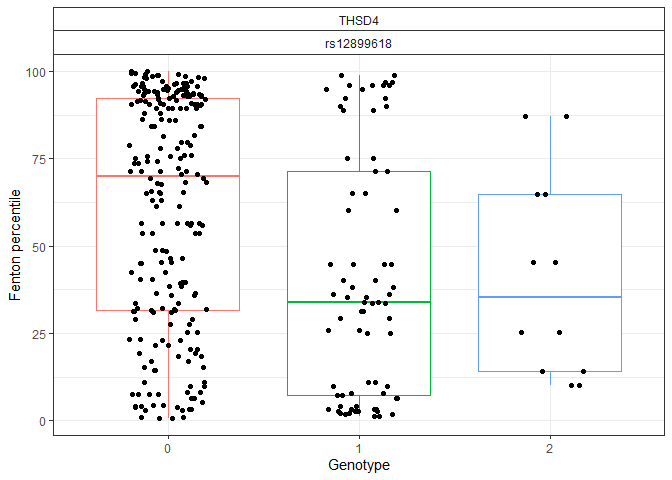
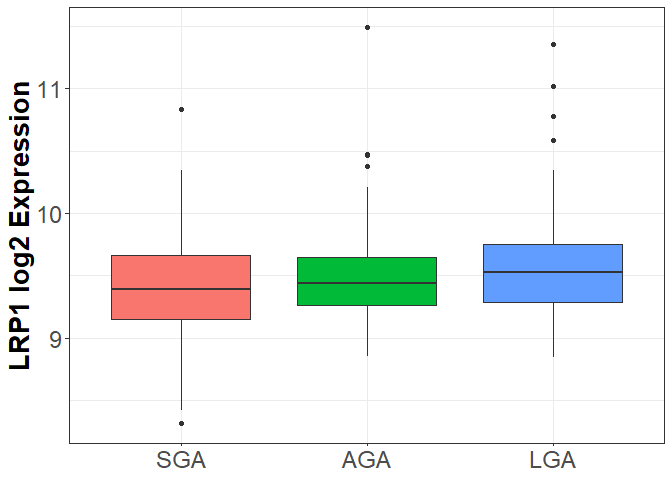

## Analysis Description

This is an R Markdown document evaluating SNPs in the PM2.5 associated
modules based on GWAS catalog (n=31). PM2.5 was averaged across the
growth. The GREW window is positively correlated with the red, turquoise
and tan modules and inversely correlated with the blue and yellow
modules.  
In addition to the GWAS catalog SNPs enriched in these modules, we
additionally pulled in eSNPs from our eQTL data that fell within +/-20kb
of the GWAS hits (n = 82 eSNPs). None of the eSNPs map to GWAS hits.  
Using these compiled sets of GWAS hits and eSNPs (n=518 SNPs), we pulled
down SNP genotyping data in the RICHS data set. Data was available for
187 participants (n = 440 SNPs). Merging the genotyping data with RICHs
gene expression and BW data, we performed ANOVA to look for
relationships between the SNPs and BW/gene expression.

We see significant associations between SNPs/gene expression and gene
expression and BW for 7 genes at FDR \< 0.05. One gene (THSD4, red
module, pulmonary function) was associated in the SNPs/BW analysis (FDR
\>0.02). FADS1 Blue Fatty Acid FADS2 Blue Fatty Acid FADS3 Blue Fatty
Acid LRP1 Red Migraine/Pulmonary RHOB Blue Sclerosis SPTY2D1 Red
Cholesterol TNFRSF19 Blue Nasopharyngeal Cancer

One ideogram was generated for one gene from each module.

## Load required libraries

``` r
library(biomaRt)
library(tidyverse)
library(tidyr)
library(GenomicRanges)
library(broom)

library(Gviz)
library(data.table)
library(GenomicFeatures)
library(TxDb.Hsapiens.UCSC.hg19.knownGene)
library(rtracklayer)
library(gwascat)
```

## Load required datasets

``` r
GWAS_module_enrich<-read.csv("../GWAS/GWAS_Gene_enrich.csv")
GWAS<-read.csv("../GWAS/gwas_catalog_v1.0.1.csv")

eSNPs<-read.csv("../../eQTL/eQTL_genes_hg37.csv")
eQTL_IDs<-read.csv("../../eQTL/ID.csv",header=T,row.names=NULL)

Covariates<-readRDS("../../RICHS_Variables/QCHART_01.11.14v1.rds")#799

lnames = load(file = "../WGCNA_input.RData"); #200
```

## Format Covariate data

``` r
Covariates%>%
  dplyr::select(HOUSEHOLD_INCOME)%>%
  filter(!HOUSEHOLD_INCOME%in%c(0,157,158,NA))%>%
  summarise(q33=quantile(.,probs=c(0.33),na.rm=T),
            q66=quantile(.,probs=c(0.66),na.rm=T))
```

    ##   q33 q66
    ## 1 152 155

``` r
Demo<-Covariates%>%
  dplyr::rename(ID=Sample.ID,GestAge=GESTATIONAL_WEEKS.x,F13perc=F13.percentile,F13Group=F13.BW.group,Sex=Gender.x,DOB=DATE_OF_BIRTH,DM=DELIVERY_METHOD1,MomAge=MATERNAL_AGE_YRS,Parity=MATERNAL_TERM_BIRTHS, Smoke=TOBACCO_PREGNANCY2,Edu=MOM_EDUCATION1,Race=MATERNAL_ETHNICITY2,Income=HOUSEHOLD_INCOME,GDM=DIABETES_GESTATIONAL_PREGNANCY2,HTN=HYPERTENSION_PREGNANCY)%>%
  dplyr::select(ID,DOB,F13perc,F13Group,GestAge,Sex,DM,Parity, MomAge,Race,Edu,Income, Smoke,GDM,BMI,HTN)%>%
  mutate(ID=as.character(ID),
         HTN=as.factor(ifelse(is.na(HTN),NA,
                              ifelse(HTN==6,"Yes","No"))),
         Parity=as.factor(ifelse(Parity==10|is.na(Parity),NA,
                       ifelse(Parity==0,"Nulliparous","Parous"))),
         Edu=as.factor(ifelse(is.na(Edu),NA,
                              ifelse(Edu=="< 11th grade","Less than HS grad",
                                     ifelse(Edu=="High school graduate","HS grad",
                                            ifelse(Edu=="Junior college graduate or equivalent", "Some College", "College grad and above"))))),
         Race=as.factor(ifelse(is.na(Race),NA,
                               ifelse(Race=="White","White",
                                      ifelse(Race=="Black","Black","Other")))),
         Income=as.factor(ifelse(is.na(Income)|Income==0|Income>156,NA,
                                 ifelse(Income>0&Income<152,"<30K",
                                        ifelse(Income>=152&Income<155,"30-79K","80K+")))),
         DOB=gsub("/.*$","",DOB),
         Season=as.factor(ifelse(DOB%in%c("12","2","1"),"Winter",
                                ifelse(DOB%in%c("3","4","5"),"Spring",
                                        ifelse(DOB%in%c("6","7","8"),"Summer","Fall")))))
```

## Format GWAS gene data: subset to relevant modules and add hg19 locations of SNPs

``` r
#restrict to PM2.5 relevant modules
GWAS_modules_GREW<-GWAS_module_enrich%>%
  filter(Module%in%c("red","turquoise","tan","blue","yellow"))%>%
  dplyr::select(Module,Gene,Trait)

#Figures of top GWAS traits
RICHS_WGCNA_GWAS_traits_GREW<-
  GWAS_modules_GREW%>%
  mutate(Trait=gsub("\\(.+?\\)","",Trait),
         Trait=str_trim(Trait))%>%
  count(Module,Trait)%>%
  group_by(Module)%>%
    mutate(prop=n/sum(n))%>%
  arrange(Module,desc(n))%>%
  group_by(Module)%>%
 slice_max(order_by=n,n=5,with_ties=FALSE)%>%
  mutate(Trait=ifelse(Trait=="3-hydroxypropylmercapturic acid levels in smokers","HPMA levels in smokers",
                      ifelse(Trait=="Age-related hearing impairment","Hearing impairment with age",
         ifelse(Trait=="Coronary artery disease or large artery stroke","Coronary artery disease/Stroke",as.character(Trait)))))%>%
  ggplot(.,aes(x=Trait,y=prop))+
  geom_bar(stat="identity")+
  theme_bw()+
  theme(axis.title=element_blank(),
        axis.text.x=element_text(angle=45,hjust=1,size=10),
        strip.text.x = element_text(size=10,face="bold"),
  strip.background = element_rect(fill = "white"))+
  facet_wrap(.~Module,scales="free")

RICHS_WGCNA_GWAS_traits_GREW
```

<!-- -->

``` r
pdf('Plots/RICHS_WGCNA_GWAS_traits_GREW.pdf',height=10,width=15)
RICHS_WGCNA_GWAS_traits_GREW
dev.off()

#format GWAS dataset and add SNP information
GWAS_unique_subset<-GWAS %>% 
  dplyr::select(MAPPED_GENE,DISEASE.TRAIT,SNPS)%>%
  dplyr::rename(Gene=MAPPED_GENE,Trait=DISEASE.TRAIT,SNP=SNPS)%>%
  mutate(Gene=str_replace(Gene,"\\s-\\s",";"))%>%
  separate(Gene, c("Gene.1","Gene.2","Gene.3","Gene.4","Gene.5"), sep = "([,;])")%>%
  gather(Type,Gene,-c(Trait,SNP))%>%
  drop_na(Gene)%>%
  dplyr::select(Gene,Trait,SNP)%>%
  distinct()

GWAS_modules_GREW_SNP<-GWAS_unique_subset%>%
  right_join(GWAS_modules_GREW,by=c('Gene','Trait'))

##########################   Add hg19 locations
ensembl = useMart(biomart="ENSEMBL_MART_SNP", host="grch37.ensembl.org", path="/biomart/martservice" ,dataset="hsapiens_snp")
#listDatasets(ensembl)
#identify relevant filters
filters=listFilters(ensembl)
#identify relevant attributes
attributes=listAttributes(ensembl)
#create list of genes of interest

snp_GREW<-unique(as.character(GWAS_modules_GREW_SNP$SNP)) #490 SNPs

dbSNP_GREW<-getBM(attributes=c('chr_name','chrom_start','refsnp_id'),filters=c('snp_filter'), values=list(snp_GREW), mart=ensembl)

dbSNP_GREW <-dbSNP_GREW%>%
  filter(!grepl("H",chr_name))%>%
  dplyr::rename(SNP=refsnp_id)%>%
  mutate(hg19_location=paste0(chr_name,":",chrom_start))%>%
  left_join(GWAS_modules_GREW_SNP)%>%
  dplyr::select(SNP,hg19_location,everything())%>%
  arrange(hg19_location) #580 SNPs


#################################    pull genomic ranges of QTLs within 20kb of SNPs
eSNPs<-eSNPs%>%
  dplyr::rename(eGene=Gene)%>%
  dplyr::select(eGene,eSNP,dbSNP)%>%
  mutate(chr=gsub(":.*","",eSNP),
         start=gsub(".*:","",eSNP))%>%
 mutate_at(c("chr", "start"), as.numeric)%>%
  drop_na(start)
         
eSNP_ranges<-makeGRangesFromDataFrame(eSNPs,
                         keep.extra.columns=TRUE,
                         seqnames.field=c("chr"),
                         start.field="start",
                         end.field=c("start"))


dbSNPgrew_ranges<-makeGRangesFromDataFrame(dbSNP_GREW,
                         keep.extra.columns=TRUE,
                         seqnames.field=c("chr_name"),
                         start.field="chrom_start",
                         end.field=c("chrom_start"))

dbSNPgrew_ranges <- dbSNPgrew_ranges + 20000 #add 20kb up and downstream
  
eSNPgrew_GWAS_hits<-mergeByOverlaps(dbSNPgrew_ranges,eSNP_ranges)


#combine eSNPs with GWAS hits
eSNPgrew_dbSNP<-data.frame(Gene=as.character(eSNPgrew_GWAS_hits@listData$Gene),eGene=as.character(eSNPgrew_GWAS_hits@listData$eGene),hg19_location=as.character(eSNPgrew_GWAS_hits@listData$eSNP),dbSNP=as.character(eSNPgrew_GWAS_hits@listData$dbSNP))

eSNP_dbSNP_GREW<-eSNPgrew_dbSNP%>%
  mutate(eQTL="Yes",
         chr_name=gsub(":.*","",hg19_location),
         chrom_start=gsub(".*:","",hg19_location))%>%
  dplyr::rename(SNP=dbSNP)%>%
  mutate_at(c("chrom_start"), as.numeric)%>%
  distinct(SNP,.keep_all = T)
  

dbSNP_GREW<-bind_rows(dbSNP_GREW,eSNP_dbSNP_GREW)%>%
  arrange(hg19_location) 

dbSNP_GREW$SNP[dbSNP_GREW$eQTL=="Yes"&!is.na(dbSNP_GREW$Module)]
#no eQTLs match GWAS hits

SNPS_GREW<-c('ID',as.character(dbSNP_GREW$hg19_location))
output.file <- file("Data/SNPs/RICHS_PM25_GREW_module_eSNP_GWAS_POS.txt", "wb")
write.table(as.data.frame(SNPS_GREW), file = output.file , col.names=F, row.names = F, quote = F)
close(output.file)
```

## Load genotyping data

``` r
PMGWAS_GREW<-read.table("Data/SNPs/RICHS_PM25_GREW_module_eSNP_GWAS_genotypes.txt",header=T,check.names=F,row.names=1)
#440 out of 518 GWAS/eSNP hits in RICHS dataset (n=187)
```

## Format data to clean up genotyping calls and subset to QC (n=159)

``` r
PMGWAS_GREW<-as.data.frame(t(PMGWAS_GREW))
PMGWAS_GREW<-as.data.frame(apply(PMGWAS_GREW,2,function (x) {ifelse(x>=0&x<=0.2,0,
                                    ifelse(x>=0.8&x<=1.2,1,
                                      ifelse(x>=1.8,2,NA)))}))
row.names(PMGWAS_GREW)<-gsub("X","",row.names(PMGWAS_GREW))
PMGWAS_GREW<-PMGWAS_GREW[row.names(PMGWAS_GREW)%in%eQTL_IDs$ID,] #440 SNPs, 159 subjects
```

## Calculate MAF and filter if below 5%

``` r
MAF_GREW_table<-PMGWAS_GREW %>%
  gather(hg19_location,Allele) %>%
  group_by(hg19_location,Allele) %>%
  count() %>%
  spread(Allele,n) %>%
  dplyr::rename(Allele0='0',Allele1='1',Allele2='2',Missing='<NA>')%>%
  rowwise() %>%
  mutate(MAF=((2*min(Allele0,Allele1,Allele2))+Allele1)/(2*sum(Allele0,Allele1,Allele2)),
         Missing=Missing/nrow(PMGWAS_GREW))%>%
  filter(Allele0>5 & Allele2>5 & MAF > 0.05)

#286 SNPs pass sufficient genotype count
```

## Set reference allele to allele with major allele frequency and subset dataset to SNPs with sufficient MAF (21 SNPs)

``` r
REF.table<-MAF_GREW_table %>%
  dplyr::select(Allele0,Allele2)

REF<-colnames(REF.table)[apply(REF.table,1,which.max)]
ALT<-colnames(REF.table)[apply(REF.table,1,which.min)]

MAF_GREW_table<-cbind(MAF_GREW_table,REF=REF,ALT=ALT)

MAF_GREW_table<-merge(MAF_GREW_table,dbSNP_GREW,by="hg19_location",all.x=T)
MAF_GREW_table<-MAF_GREW_table%>%
  dplyr::select(SNP,hg19_location,everything())


#6 extra SNPs not in our query list > drop from genotype file 
MAF_GREW_table<-MAF_GREW_table%>%
  drop_na(SNP) 

dbSNP_GREW<-dbSNP_GREW%>%
  filter(SNP%in%MAF_GREW_table$SNP) #300 SNPs

PMGWAS_GREW<-PMGWAS_GREW[,names(PMGWAS_GREW)%in%dbSNP_GREW$hg19_location] #280 SNPs
```

## SNPs and gene expression AOV

``` r
#subset expression data-set to genes of interest
GenEx_GREW<-datExpr0%>%
  dplyr::select(unique(dbSNP_GREW$Gene))%>%
  rownames_to_column()%>%
  dplyr::rename(ID=rowname)%>%
  gather(Gene,Value,-ID)


PMGWAS_GREW_gather<-PMGWAS_GREW%>%
  rownames_to_column()%>%
  dplyr::rename(ID=rowname)%>%
  gather(hg19_location,Genotype,-ID)%>%
  left_join(dbSNP_GREW,by='hg19_location')%>%
  dplyr::select(ID,Gene,SNP,Genotype)


GenEx_GWAS_GREW<-PMGWAS_GREW_gather%>%
  inner_join(GenEx_GREW,by=c("ID","Gene"))%>%
  drop_na()

#################################    ANOVA

GenEx_GWAS_GREW_AOV<-GenEx_GWAS_GREW%>%
  #filter(!SNP%in%drop_SNP)%>% #drop eSNPs that are QTLs of other genes
  group_by(Gene,SNP)%>%
  do(tidy(aov(as.numeric(Value)~factor(Genotype), data = .)))%>%
  filter(!term=="Residuals")%>%
  ungroup()%>%
  mutate(FDR=p.adjust(p.value,method='fdr'))%>%
  filter(FDR<0.05)%>% #38 SNPs
  arrange(FDR)

dbSNP_GREW%>%filter(SNP%in%GenEx_GWAS_GREW_AOV$SNP[GenEx_GWAS_GREW_AOV$FDR<0.05])%>%dplyr::select(Gene,Module,Trait) %>% drop_na(Trait)%>% distinct()%>%arrange(Gene)

#    Gene    Module                                                 Trait
#    CEP120      blue                                                Weight
#   EPB41L2      blue                                     IgG glycosylation
#      ERI1      blue                                 Myopia (pathological)
#     FADS1      blue                          Phospholipid levels (plasma)
#     FADS1      blue                               Trans fatty acid levels
#     FADS2      blue                          Phospholipid levels (plasma)
#     FADS2      blue                               Trans fatty acid levels
#     FADS3      blue                          Phospholipid levels (plasma)
#     FADS3      blue                               Trans fatty acid levels
#     GCDH      blue                           Mean corpuscular hemoglobin
#     HIP1      blue                          Systemic lupus erythematosus
#     LRP1       red                                 Migraine without aura
#     LRP1       red                                    Pulmonary function
#     LRP1       red                      Pulmonary function (interaction)
#    LZTS2      blue Ejection fraction in Tripanosoma cruzi seropositivity
#    MFAP2       red                                    Pulmonary function
#    MFAP2       red                      Pulmonary function (interaction)
#   MRPS22 turquoise                                        Ear morphology
#     MUC1       red                                      Magnesium levels
#     RHOB      blue                                    Systemic sclerosis
#  SMARCA4 turquoise            Coronary artery disease or ischemic stroke
#  SMARCA4 turquoise        Coronary artery disease or large artery stroke
#  SPTY2D1       red                                    Cholesterol, total
# TNFRSF19      blue                              Nasopharyngeal carcinoma
#   ZC3HC1 turquoise            Coronary artery disease or ischemic stroke
#   ZC3HC1 turquoise        Coronary artery disease or large artery stroke

#plot expression by genotype
RICHS_WGCNA_GWAS_eSNPs_GREW<-GenEx_GWAS_GREW%>%
  filter(SNP%in%GenEx_GWAS_GREW_AOV$SNP[GenEx_GWAS_GREW_AOV$FDR<0.05])%>%
  ggplot(aes(factor(Genotype),Value))+
  geom_boxplot(aes(colour = factor(Genotype)))+
  #geom_jitter(width=0.2)+
  labs(x="Genotype",y="log2 expression")+
  theme_bw()+
  theme(legend.position = "none",
        strip.background = element_rect(fill="white"))+
  facet_wrap(Gene~SNP)

RICHS_WGCNA_GWAS_eSNPs_GREW
```

<!-- -->

``` r
pdf("Plots/RICHS_WGCNA_GWAS_eSNPs_GREW.pdf")
RICHS_WGCNA_GWAS_eSNPs_GREW
dev.off()

RICHS_WGCNA_GWAS_eSNPs_GREW_subset<-GenEx_GWAS_GREW%>%
  filter(SNP%in%GenEx_GWAS_GREW_AOV$SNP[GenEx_GWAS_GREW_AOV$FDR<0.05]&Gene%in%c("FADS1","FADS2","FADS3","LRP1","RHOB","SPTY2D1","TNFRSF19"))%>%
  ggplot(aes(factor(Genotype),Value))+
  geom_boxplot(aes(colour = factor(Genotype)))+
  #geom_jitter(width=0.2)+
  labs(x="Genotype",y="log2 expression")+
  theme_bw()+
  theme(legend.position = "none",
        strip.background = element_rect(fill="white"))+
  facet_wrap(Gene~SNP,scale="free")

RICHS_WGCNA_GWAS_eSNPs_GREW_subset
```

<!-- -->

``` r
pdf("Plots/RICHS_WGCNA_GWAS_eSNPs_GREW_subset.pdf")
RICHS_WGCNA_GWAS_eSNPs_GREW_subset
dev.off()


RICHS_WGCNA_GWAS_eSNPs_SPTY2D1_GREW<-GenEx_GWAS_GREW%>%
  filter(Gene=="SPTY2D1")%>%
  ggplot(aes(factor(Genotype),Value))+
  geom_boxplot(aes(colour = factor(Genotype)))+
  geom_jitter(width=0.2,alpha=1/5)+
  labs(x="Genotype",y="SPTY2D1 log2 expression")+
  theme_bw()+
  theme(legend.position = "none",
        strip.background = element_rect(fill="white"))+
 facet_wrap(Gene~SNP) 

pdf("Plots/RICHS_WGCNA_GWAS_eSNPs_SPTY2D1_GREW.pdf")
RICHS_WGCNA_GWAS_eSNPs_SPTY2D1_GREW
dev.off()


RICHS_WGCNA_GWAS_eSNPs_LRP1_GREW<-GenEx_GWAS_GREW%>%
  filter(Gene=="LRP1"&SNP=="rs11172113")%>%
  ggplot(aes(factor(Genotype),Value))+
  geom_boxplot(aes(fill = factor(Genotype)))+
  #geom_jitter(width=0.2,alpha=1/5)+
  labs(x="rs11172113",y="LRP1 log2 expression")+
  theme_bw()+
  theme(legend.position = "none",
        axis.title=element_text(face="bold",size=20),
        axis.text=element_text(size=18))

RICHS_WGCNA_GWAS_eSNPs_LRP1_GREW
```

<!-- -->

``` r
pdf("Plots/RICHS_WGCNA_GWAS_eSNPs_LRP1_GREW.pdf")
RICHS_WGCNA_GWAS_eSNPs_LRP1_GREW
dev.off()
```

## SNPs and BW AOV

``` r
GenEx_GWAS_GREW_BW<-Demo%>%
  dplyr::select(ID,F13perc,F13Group)%>%
  right_join(GenEx_GWAS_GREW)
```

    ## Joining, by = "ID"

``` r
BW_GWAS_GREW_AOV<-GenEx_GWAS_GREW_BW%>%
  #filter(!SNP%in%drop_SNP)%>% #drop eSNPs that are QTLs of other genes
  group_by(SNP)%>%
  do(tidy(aov(as.numeric(F13perc)~factor(Genotype), data = .)))%>%
  filter(!term=="Residuals")%>%
  ungroup()%>%
  mutate(FDR=p.adjust(p.value,method='fdr'))%>%
  arrange(FDR)

dbSNP_GREW%>%filter(SNP%in%BW_GWAS_GREW_AOV$SNP[BW_GWAS_GREW_AOV$FDR<0.2])%>%dplyr::select(Gene,Module,Trait)%>%drop_na(Trait)%>%distinct() 
#rs12899618 THSD4       Pulmonary function                red  0.004
#rs12899618 THSD4   Pulmonary function (interaction)  red  0.004

#plot BW percentile by genotype
RICHS_WGCNA_GWAS_BW_THSDA4_GREW<-GenEx_GWAS_GREW_BW%>%
  filter(SNP%in%BW_GWAS_GREW_AOV$SNP[which.min(BW_GWAS_GREW_AOV$FDR)])%>%
  ggplot(aes(factor(Genotype),F13perc))+
  geom_boxplot(aes(colour = factor(Genotype)))+
  geom_jitter(width=0.2)+
  labs(x="Genotype",y="Fenton percentile")+
  theme_bw()+
  theme(legend.position = "none",
        strip.background = element_rect(fill="white"))+
  facet_wrap(Gene~SNP)

RICHS_WGCNA_GWAS_BW_THSDA4_GREW
```

<!-- -->

``` r
pdf("Plots/RICHS_WGCNA_GWAS_BW_THSDA4_GREW.pdf")
RICHS_WGCNA_GWAS_BW_THSDA4_GREW
dev.off()
```

## Gene expression and BW

``` r
BW_GenEx_GREW_AOV<-GenEx_GWAS_GREW_BW%>%
  #filter(!SNP%in%drop_SNP)%>% #drop eSNPs that are QTLs of other genes
  group_by(Gene)%>%
  do(tidy(aov(as.numeric(Value)~factor(F13Group), data = .)))%>%
  filter(!term=="Residuals")%>%
  ungroup()%>%
  mutate(FDR=p.adjust(p.value,method='fdr'))%>%
  filter(FDR<0.05)


dbSNP_GREW%>%filter(Gene%in%BW_GenEx_GREW_AOV$Gene[BW_GenEx_GREW_AOV$FDR<0.05])%>%dplyr::select(Gene,Trait,Module)%>%drop_na(Trait)%>%distinct()

#       Gene                                           Trait    Module
#  ARHGAP29                               IgG glycosylation      blue
#  SPTY2D1                              Cholesterol, total       red
#     FADS1                         Trans fatty acid levels      blue
#     FADS1                    Phospholipid levels (plasma)      blue
#    FADS2                         Trans fatty acid levels      blue
#    FADS2                    Phospholipid levels (plasma)      blue
#    FADS3                         Trans fatty acid levels      blue
#    FADS3                    Phospholipid levels (plasma)      blue
#     LRP1                           Migraine without aura       red
#     LRP1                              Pulmonary function       red
#     LRP1                Pulmonary function (interaction)       red
# TNFRSF19                        Nasopharyngeal carcinoma      blue
#      CDH1                    Cutaneous malignant melanoma    yellow
#     PEMT  Coronary artery disease or large artery stroke turquoise
#     PEMT      Coronary artery disease or ischemic stroke turquoise
#   ZNF652                                  Blood pressure turquoise
#     GCDH                     Mean corpuscular hemoglobin      blue
#     FIGN                                  Blood pressure turquoise
#     RHOB                              Systemic sclerosis      blue
#   ZNF512                    Phospholipid levels (plasma)      blue
#     TOM1                              Cholesterol, total       red
#  ST6GAL1                               IgG glycosylation      blue
#      LPP                                          Weight      blue
#     RARB                               IgG glycosylation      blue
#     RARB Parental extreme longevity (95 years and older)      blue
#      ELL2                               IgG glycosylation      blue
#    ELOVL2                    Phospholipid levels (plasma)      blue
#   NOTCH4                              Systemic sclerosis      blue
#   NOTCH4                    Systemic lupus erythematosus      blue
#    ANGPT1                               IgG glycosylation      blue
#  FAM167A                    Systemic lupus erythematosus      blue
#     PSD3                            Lung function (FEV1)    yellow
#      TEK                               IgG glycosylation      blue
#      TEK                         Trans fatty acid levels      blue


#plot BW percentile by genotype
RICHS_WGCNA_GenEx_BW_GREW<-GenEx_GWAS_GREW_BW%>%
  filter(Gene%in%BW_GenEx_GREW_AOV$Gene[BW_GenEx_GREW_AOV$FDR<0.05])%>%
  mutate(F13Group=factor(F13Group,levels=c("SGA","AGA","LGA")))%>%
  ggplot(aes(factor(F13Group),Value))+
  geom_boxplot(aes(colour = factor(F13Group)))+
  #geom_jitter(width=0.2, alpha=1/5)+
  labs(x="Fenton Group",y=" log2 Expression")+
  theme_bw()+
  theme(legend.position = "none",
        strip.background = element_rect(fill="white"))+
  facet_wrap(~Gene,scales="free")

RICHS_WGCNA_GenEx_BW_GREW
```

<!-- -->

``` r
pdf("Plots/RICHS_WGCNA_GenEx_BW_GREW.pdf")
RICHS_WGCNA_GenEx_BW_GREW
dev.off()

RICHS_WGCNA_GenEx_BW_GREW_subset<-GenEx_GWAS_GREW_BW%>%
  filter(Gene%in%BW_GenEx_GREW_AOV$Gene[BW_GenEx_GREW_AOV$FDR<0.05]&Gene%in%c("FADS1","FADS2","FADS3","LRP1","RHOB","SPTY2D1","TNFRSF19"))%>%
  mutate(F13Group=factor(F13Group,levels=c("SGA","AGA","LGA")))%>%
  ggplot(aes(factor(F13Group),Value))+
  geom_boxplot(aes(colour = factor(F13Group)))+
  #geom_jitter(width=0.2, alpha=1/5)+
  labs(x="Fenton Group",y=" log2 Expression")+
  theme_bw()+
  theme(legend.position = "none",
        strip.background = element_rect(fill="white"))+
  facet_wrap(~Gene,scales="free")

RICHS_WGCNA_GenEx_BW_GREW_subset
```

<!-- -->

``` r
pdf("Plots/RICHS_WGCNA_GenEx_BW_GREW_subset.pdf")
RICHS_WGCNA_GenEx_BW_GREW_subset
dev.off()


RICHS_WGCNA_GenEx_BW_GREW_LRP1<-GenEx_GWAS_GREW_BW%>%
  filter(Gene=="LRP1")%>%
  mutate(F13Group=factor(F13Group,levels=c("SGA","AGA","LGA")))%>%
  ggplot(aes(factor(F13Group),Value))+
  geom_boxplot(aes(fill = factor(F13Group)))+
  #geom_jitter(width=0.2, alpha=1/5)+
  labs(y="LRP1 log2 Expression")+
  theme_bw()+
  theme(legend.position = "none",
        axis.title.x=element_blank(),
        axis.title.y=element_text(face="bold",size=20),
        axis.text=element_text(size=18))

RICHS_WGCNA_GenEx_BW_GREW_LRP1
```

<!-- -->

``` r
pdf("Plots/RICHS_WGCNA_GenEx_BW_GREW_LRP1.pdf")
RICHS_WGCNA_GenEx_BW_GREW_LRP1
dev.off()
```

## Ideogram of FADS3 SNPs

``` r
#data(ebicat37) #data from 2016
newcatr = makeCurrentGwascat(genome='GRCh37') 

###################format datasets'
#SNP-Expression 
FADS3_AOV<-GenEx_GWAS_GREW_AOV%>%
  left_join(dbSNP_GREW,by=c("Gene","SNP"))%>%
  dplyr::select(Gene,SNP,p.value,chr_name,chrom_start,Trait,eQTL)%>%
  filter(Gene=="FADS3")%>%
  mutate(log10pvalue=-log10(p.value))%>%
  distinct(SNP,.keep_all = T) # 2SNPs, 2 associations each


FADS3_expression_range<-makeGRangesFromDataFrame(FADS3_AOV,
                         keep.extra.columns=TRUE,
                         seqnames.field=c("chr_name"),
                         start.field="chrom_start",
                         end.field=c("chrom_start"))

#BW-Expression 
FADS3_AOV<-BW_GWAS_GREW_AOV%>%
  left_join(dbSNP_GREW,by=c("SNP"))%>%
  dplyr::select(Gene,SNP,p.value,chr_name,chrom_start,Trait,eQTL)%>%
  filter(Gene=="FADS3")%>%
  mutate(log10pvalue=-log10(p.value))%>%
  distinct(SNP,.keep_all = T)


FADS3_BW_range<-makeGRangesFromDataFrame(FADS3_AOV,
                         keep.extra.columns=TRUE,
                         seqnames.field=c("chr_name"),
                         start.field="chrom_start",
                         end.field=c("chrom_start"))


chr<-'chr11'
from<-61639000
to<- 61659006


FADS3_anno = GRanges(seqnames=chr, ranges=IRanges(start=from,end=to))
seqlevelsStyle(FADS3_anno) = "UCSC"
seqlevelsStyle(newcatr) = "UCSC"
basic = gwcex2gviz(basegr = newcatr, contextGR=FADS3_anno, plot.it=FALSE)


Expression_DataTrack = DataTrack(FADS3_expression_range, chrom="chr11", genome="hg19", data="log10pvalue", name="log10 pvalue (QTL)")
displayPars(Expression_DataTrack)$col = "black"
displayPars(Expression_DataTrack)$frame=TRUE
displayPars(Expression_DataTrack)$col.frame="lightgray"

BW_DataTrack = DataTrack(FADS3_BW_range, chrom="chr11", genome="hg19", data="log10pvalue", name="log10 pvalue (BW)")
displayPars(BW_DataTrack)$col = "red"
displayPars(BW_DataTrack)$frame=TRUE
displayPars(BW_DataTrack)$col.frame="lightgray"

gtrack <- GenomeAxisTrack()
itrack <- IdeogramTrack(genome = 'hg19', chromosome = chr)

hg19 <- useMart("ensembl", "hsapiens_gene_ensembl")

FADS3_txTr<-BiomartGeneRegionTrack(genome="hg19", chr='chr11',start=61639000, end=61659006,transcriptAnnotation = "symbol",name='FADS3',collapseTranscripts=T)

ht <- HighlightTrack(trackList = list(basic[[1]], Expression_DataTrack,BW_DataTrack),
                     start = 61639200, end = 61639700, chromosome = "chr11")


plotTracks(list(itrack,gtrack,FADS3_txTr,ht),from=61639000,to=61659006,background.title = "brown4",showId=TRUE)
```

<!-- -->

``` r
pdf("Plots/RICHS_FADS3_ideogram.pdf",width=6,height=5)
plotTracks(list(itrack,gtrack,FADS3_txTr,ht),from=61639000,to=61659006,background.title = "brown4",showId=TRUE)
dev.off()

ag = function(x) as(x, "GRanges")
ovraw = suppressWarnings(subsetByOverlaps(ag(newcatr), FADS3_anno))
length(ovraw)
#rs2284746
#online catalog also includes rs761422
```

## Ideagram of LRP1 SNPs

``` r
#data(ebicat37) #data from 2016
newcatr = makeCurrentGwascat(genome='GRCh37') 

###################format datasets'
#SNP-Expression 
LRP1_AOV<-GenEx_GWAS_GREW_AOV%>%
  left_join(dbSNP_GREW,by=c("Gene","SNP"))%>%
  dplyr::select(Gene,SNP,p.value,chr_name,chrom_start,Trait,eQTL)%>%
  filter(Gene=="LRP1")%>%
  mutate(log10pvalue=-log10(p.value))%>%
  distinct(SNP,.keep_all = T) # 1SNPs, 2 associations each


LRP1_expression_range<-makeGRangesFromDataFrame(LRP1_AOV,
                         keep.extra.columns=TRUE,
                         seqnames.field=c("chr_name"),
                         start.field="chrom_start",
                         end.field=c("chrom_start"))

#BW-Expression 
LRP1_AOV<-BW_GWAS_GREW_AOV%>%
  left_join(dbSNP_GREW,by=c("SNP"))%>%
  dplyr::select(Gene,SNP,p.value,chr_name,chrom_start,Trait,eQTL)%>%
  filter(Gene=="LRP1")%>%
  mutate(log10pvalue=-log10(p.value))%>%
  distinct(SNP,.keep_all = T)


LRP1_BW_range<-makeGRangesFromDataFrame(LRP1_AOV,
                         keep.extra.columns=TRUE,
                         seqnames.field=c("chr_name"),
                         start.field="chrom_start",
                         end.field=c("chrom_start"))


chr<-'chr12'
from<-57522282
to<- 57607125


LRP1_anno = GRanges(seqnames=chr, ranges=IRanges(start=from,end=to))
seqlevelsStyle(LRP1_anno) = "UCSC"
seqlevelsStyle(newcatr) = "UCSC"
basic = gwcex2gviz(basegr = newcatr, contextGR=LRP1_anno, plot.it=FALSE)


Expression_DataTrack = DataTrack(LRP1_expression_range, chrom="chr12", genome="hg19", data="log10pvalue", name="log10 pvalue (QTL)")
displayPars(Expression_DataTrack)$col = "black"
displayPars(Expression_DataTrack)$frame=TRUE
displayPars(Expression_DataTrack)$col.frame="lightgray"

BW_DataTrack = DataTrack(LRP1_BW_range, chrom="chr12", genome="hg19", data="log10pvalue", name="log10 pvalue (BW)")
displayPars(BW_DataTrack)$col = "red"
displayPars(BW_DataTrack)$frame=TRUE
displayPars(BW_DataTrack)$col.frame="lightgray"

gtrack <- GenomeAxisTrack()
itrack <- IdeogramTrack(genome = 'hg19', chromosome = chr)

hg19 <- useMart("ensembl", "hsapiens_gene_ensembl")

LRP1_txTr<-BiomartGeneRegionTrack(genome="hg19", chr='chr12',start=57522200, end=57607200,transcriptAnnotation = "symbol",name='LRP1',collapseTranscripts=T)

ht <- HighlightTrack(trackList = list(basic[[1]], Expression_DataTrack,BW_DataTrack),
                     start = 57527000, end = 57527500, chromosome = "chr12")

plotTracks(list(itrack,gtrack,LRP1_txTr,ht),from=57522200,to=57607200,background.title = "brown4",showId=TRUE)
```

<!-- -->

``` r
pdf("Plots/RICHS_LRP1_ideogram.pdf",width=6,height=5)
plotTracks(list(itrack,gtrack,LRP1_txTr,ht),from=57522200,to=57607200,background.title = "brown4",showId=TRUE)
dev.off()

ag = function(x) as(x, "GRanges")
ovraw = suppressWarnings(subsetByOverlaps(ag(newcatr), LRP1_anno))
length(ovraw)
#rs2284746
#online catalog also includes rs761422
```
