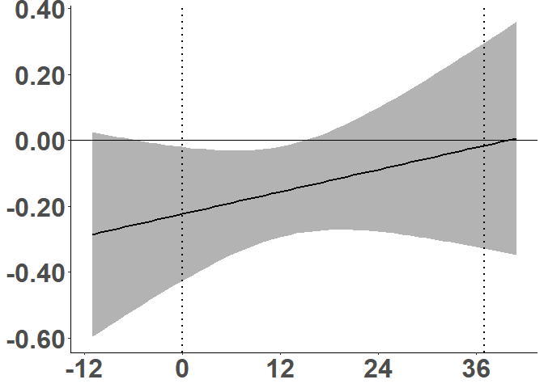
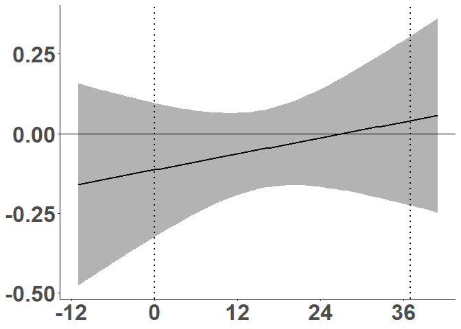
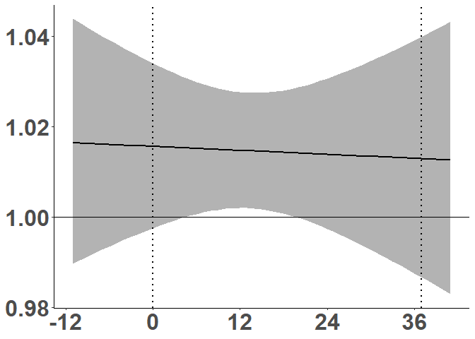
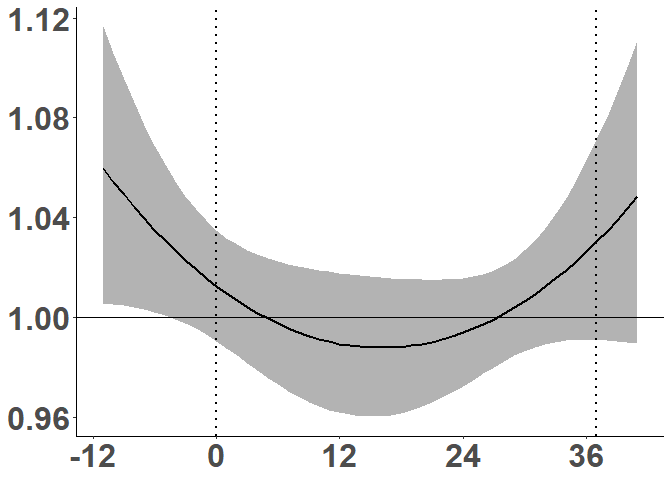
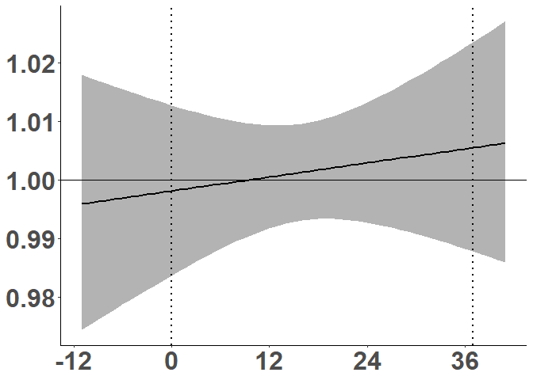

## Analysis Description

This is an R Markdown document outlining the Weekly PM2.5 DLM analysis
with respect to SGA and LGA status.  
In the SGA analysis, the model with the lowest AIC had 1 df. While there
was no overall association between PM2.5 and SGA status, a significant
window was observed ranging from 2 weeks prior to gestation and 14 weeks
after conception.  
In the LGA analysis, the model with the lowest AIC had 3 df. There was
an overall inverse association between PM2.5 and LGA status. An inverse
association with LGA status was observed during a window ranging from 3
weeks prior to gestation to 8 weeks of gestation. An positive
association with LGA status was observed during a window ranging from
29-32 weeks gestation.  
Modeling BW as a continuous outcome (Fenton percentiles, 1 df), we
observe a significant inverse association from 12 weeks prior to
conception until 13 weeks gestation.

In the sex-stratified analysis, a significant SGA window was observed
from 12 weeks to 7 weeks prior to conception among boys and 7 weeks and
16 weeks of gestation among girls. No significant window was observed
for boys in association with LGA status. A significant inverse
association was observed between 5 weeks prior to conception until 6
weeks gestation and a positive associatin was observed between 26 weeks
and 30 weeks gestation among girls. A significant reduction in fenton
percentile was observed in the 6 weeks prior to conception until 13
weeks gestation among girls. No significant window was observed in
association with fenton percentile among boys.

All models were adjusted for infant sex, gestational age, maternal age,
maternal education and season of birth.

## Load libraries

``` r
library(dlnm)
library(mgcv)
library(nlme)
library(splines)
library(Hmisc)
library (data.table)
library (ggplot2)
library(tidyverse)
library(broom)
library(tableone)
```

## Read in datasets

``` r
PM25<-readRDS("Data/richs_PM25_weekly.rds")
Covariates<-readRDS("../../RICHS_Variables/QCHART_01.11.14v1.rds")
```

## Format datasets

``` r
#Covariates subset to PM data and relevant variables
Demo<-Covariates%>%
  rename(study_id=Sample.ID,GestAge=GESTATIONAL_WEEKS.x,F13perc=F13.percentile,F13Group=F13.BW.group,Sex=Gender.x,DOB=DATE_OF_BIRTH,DM=DELIVERY_METHOD1,MomAge=MATERNAL_AGE_YRS,Parity=MATERNAL_TERM_BIRTHS, Smoke=TOBACCO_PREGNANCY2,Edu=MOM_EDUCATION1,Race=MATERNAL_ETHNICITY2,Income=HOUSEHOLD_INCOME,GDM=DIABETES_GESTATIONAL_PREGNANCY2,HTN=HYPERTENSION_PREGNANCY)%>%
  select(study_id,DOB,F13perc,F13Group,GestAge,Sex,DM,Parity, MomAge,Race,Edu,Income, Smoke,GDM,BMI,HTN)%>%
  mutate(HTN=as.factor(ifelse(is.na(HTN),NA,
                              ifelse(HTN==6,"Yes","No"))),
         Parity=as.factor(ifelse(Parity==10|is.na(Parity),NA,
                       ifelse(Parity==0,"Nulliparous","Parous"))),
         Edu=as.factor(ifelse(is.na(Edu),NA,
                              ifelse(Edu=="< 11th grade","Less than HS grad",
                                     ifelse(Edu=="High school graduate","HS grad",
                                            ifelse(Edu=="Junior college graduate or equivalent", "Some College", "College grad and above"))))),
         Race=as.factor(ifelse(is.na(Race),NA,
                               ifelse(Race=="White","White",
                                      ifelse(Race=="Black","Black","Other")))),
         Income=as.factor(ifelse(is.na(Income)|Income==0|Income>156,NA,
                                 ifelse(Income>0&Income<152,"<30K",
                                        ifelse(Income>=152&Income<155,"30-79K","80K+")))),
         DOB=gsub("/.*$","",DOB),
         Season=as.factor(ifelse(DOB%in%c("12","2","1"),"Winter",
                                ifelse(DOB%in%c("3","4","5"),"Spring",
                                        ifelse(DOB%in%c("6","7","8"),"Summer","Fall")))))%>%
  right_join(PM25)


SGA<-Demo%>%
  filter(!F13Group=="LGA")%>%
  mutate(F13Group=factor(F13Group,levels=c("AGA","SGA"))) #337 observations (77 SGA; 260 AGA)

LGA<-Demo%>%
  filter(!F13Group=="SGA")%>%
  mutate(F13Group=factor(F13Group,levels=c("AGA","LGA"))) #337 observations (77 SGA; 260 AGA)
```

## Identify optimal cross-basis parameters based on AIC for Fenton percentiles

``` r
##This creates a loop so you run models from 1-10 degrees of freedom, you get the AIC from the 10 models and then select the smallest one 
### Q2 is your exposure matrix, lag=c(1,53) is because we have 53 PM measurements in that matrix, argvar fun=lin because we are asssuming the relationship is linear, centered at 1 because we are looking at risk ratios, it would be centered at 0 if we were looking at a continuous outcome
##you vary the shape of the curve with the arglag command, here we are using b-splines and looking at 1-10 degrees of freedom (this is just how wiggly the DLM is)
### you're typically running a glm, specifiy your outcome, cbpmi is the PM exposure and the rest are your covariates, main is your data and specify family based on outcome binomial v gaussian. 

#Create exposure matrix
Q2 <- as.matrix(Demo[,18:ncol(Demo)])

mod <- list()
 for (i in 1:10) {
   cbpmi = crossbasis(Q2, lag=c(1,53),argvar=list(fun="lin",cen=0),
                      arglag=list(fun="bs",degree=i))
      mod[[i]] <- glm(F13perc~ cbpmi + factor(Sex) +GestAge+MomAge 
          +factor(Edu)+factor(Season), data=Demo, family=gaussian) 
  }
names(mod) <- paste0("MODEL", 1:10)
#AIC of models
aic_models = lapply(mod, AIC)
names(aic_models) <- paste0("MODEL", 1:10)
# Choosing the best model based on the lower AIC
aic_models
```

    ## $MODEL1
    ## [1] 4614.685
    ## 
    ## $MODEL2
    ## [1] 4616.53
    ## 
    ## $MODEL3
    ## [1] 4616.421
    ## 
    ## $MODEL4
    ## [1] 4616.036
    ## 
    ## $MODEL5
    ## [1] 4617.067
    ## 
    ## $MODEL6
    ## [1] 4617.82
    ## 
    ## $MODEL7
    ## [1] 4619.721
    ## 
    ## $MODEL8
    ## [1] 4619.312
    ## 
    ## $MODEL9
    ## [1] 4621.302
    ## 
    ## $MODEL10
    ## [1] 4622.124

``` r
# # Summary of the selected model
#sum_models = llply(mod,summary)
sum_models = lapply(mod,summary)

sum_models$MODEL1 #1 degree of freedom ** lowest AIC
```

    ## 
    ## Call:
    ## glm(formula = F13perc ~ cbpmi + factor(Sex) + GestAge + MomAge + 
    ##     factor(Edu) + factor(Season), family = gaussian, data = Demo)
    ## 
    ## Deviance Residuals: 
    ##     Min       1Q   Median       3Q      Max  
    ## -72.676  -29.771    4.641   30.796   52.336  
    ## 
    ## Coefficients:
    ##                              Estimate Std. Error t value Pr(>|t|)   
    ## (Intercept)                  97.59617   72.90850   1.339  0.18137   
    ## cbpmiv1.l1                   -0.22245    0.11132  -1.998  0.04629 * 
    ## cbpmiv1.l2                    0.04783    0.11553   0.414  0.67907   
    ## factor(Sex)Male               9.45079    3.22079   2.934  0.00351 **
    ## GestAge                      -0.53045    1.73159  -0.306  0.75949   
    ## MomAge                        0.38784    0.33421   1.160  0.24647   
    ## factor(Edu)HS grad            1.98469    4.99069   0.398  0.69105   
    ## factor(Edu)Less than HS grad -6.29073    7.59594  -0.828  0.40801   
    ## factor(Edu)Some College       1.28142    4.11099   0.312  0.75541   
    ## factor(Season)Spring          4.33347    4.43238   0.978  0.32875   
    ## factor(Season)Summer          2.49278    4.21427   0.592  0.55447   
    ## factor(Season)Winter         -3.85357    4.67137  -0.825  0.40984   
    ## ---
    ## Signif. codes:  0 '***' 0.001 '**' 0.01 '*' 0.05 '.' 0.1 ' ' 1
    ## 
    ## (Dispersion parameter for gaussian family taken to be 1135.893)
    ## 
    ##     Null deviance: 540757  on 465  degrees of freedom
    ## Residual deviance: 515695  on 454  degrees of freedom
    ##   (5 observations deleted due to missingness)
    ## AIC: 4614.7
    ## 
    ## Number of Fisher Scoring iterations: 2

## Plot PM2.5 association with Fenton percentile

``` r
###########################    Model 1
Q2 <- as.matrix(Demo[,18:ncol(Demo)])

cb1 = crossbasis(Q2, lag=c(1,53),argvar=list(fun="lin",cen=0),
                      arglag=list(fun="bs",degree=1))


model1  <- glm(F13perc~ cb1 + factor(Sex) +GestAge+MomAge 
          +factor(Edu)+factor(Season), data=Demo, family=gaussian)


#####your final prediction 
pred1<- crosspred(cb1,model1,ci.level=0.95)

###### plot your final prediction var=5, refers to a 5 ug/m3 increase in PM2.5 (basic plot)

#plot(pred1, "slices", var=5, ci="bars", type="p", col=1, pch=19,ci.level=0.95, ylab= "Fenton Percentile",main="Lag-response a 10-unit increase above threshold (95CI)")


######## plot your final prediction (ggplot2)
seqlag <-
  function(lag,by=1) seq(from=lag[1],to=lag[2],by=by) 
xvar <- as.character(10)

# store predictions into a data.frame
predpmdt <- data.table(x=seqlag(pred1$lag, pred1$bylag),
                       y=pred1$matfit[xvar[1],],
                       high=pred1$mathigh[xvar[1],],
                       # this is the lower bound of the CI 
                       low=pred1$matlow [xvar[1],])

pred1$ci

predpmdt[, range(which(low > 0))]
mycibounds <- data.table(x = predpmdt[, range(which(low > 0))] - 1)

DLM_BWperc_plot<-ggplot(predpmdt, aes(x, y)) + 
  geom_ribbon(aes(ymin = low, ymax = high), fill = "grey70") + 
  geom_line(color="black", size=1) + 
  geom_vline(xintercept = c(12,49), linetype="dotted", 
                color = "black", size=1)+
  geom_hline(yintercept = 0, color = "black")+  
  scale_x_continuous(breaks=c(0,12,24,36,48),label = c("pre12", "0", "12",  "24", "36"))+
  #scale_y_continuous(breaks=c(0.96, 0.98, 1.00, 1.02, 1.04), label=c("0.80", "0.90","1.00", "1.10", "1.20"))+
  theme_classic()+
  theme(
  axis.title = element_blank())+
  theme(axis.text=element_text(size=24,  face="bold"))

DLM_BWperc_plot
```

<!-- -->

``` r
pdf("Plots/PM25_DLM_F13perc.pdf")
DLM_BWperc_plot
dev.off()
```

## Output Fenton percentile predicted fit and intervals

``` r
pred1<- crosspred(cb1,model1,ci.level=0.95, at=5) #at = unit increase

with(pred1, c(allfit,alllow,allhigh))
#        5         5         5 
# -23.1365995 -46.7302222   0.4570231

prd<-with(pred1, c(matfit))
prdlow<-with(pred1, c(matlow))
prdhigh<-with(pred1, c(mathigh))

prd_all<-as.data.frame(cbind(beta=round(prd,2),low=round(prdlow,2),high=round(prdhigh,2)))
prd_all$week<-c(paste0('pre',rev(1:12)),0:40)

write.csv(prd_all, file = "Data/PM25_DLM_F13perc_predfit.csv",row.names=FALSE)
```

## Identify optimal cross-basis parameters based on AIC for SGA subset

``` r
##This creates a loop so you run models from 1-10 degrees of freedom, you get the AIC from the 10 models and then select the smallest one 
### Q2 is your exposure matrix, lag=c(1,53) is because we have 53 PM measurements in that matrix, argvar fun=lin because we are asssuming the relationship is linear, centered at 1 because we are looking at risk ratios, it would be centered at 0 if we were looking at a continuous outcome
##you vary the shape of the curve with the arglag command, here we are using b-splines and looking at 1-10 degrees of freedom (this is just how wiggly the DLM is)
### you're typically running a glm, specifiy your outcome, cbpmi is the PM exposure and the rest are your covariates, main is your data and specify family based on outcome binomial v gaussian. 

#Create exposure matrix
Q2 <- as.matrix(SGA[,18:ncol(SGA)])

mod <- list()
 for (i in 1:10) {
   cbpmi = crossbasis(Q2, lag=c(1,53),argvar=list(fun="lin",cen=1),
                      arglag=list(fun="bs",degree=i))
      mod[[i]] <- glm(F13Group~ cbpmi + factor(Sex) +GestAge+MomAge 
          +factor(Edu)+factor(Season), data=SGA, family=binomial) 
  }
names(mod) <- paste0("MODEL", 1:10)
#AIC of models
aic_models = lapply(mod, AIC)
names(aic_models) <- paste0("MODEL", 1:10)
# Choosing the best model based on the lower AIC
aic_models
```

    ## $MODEL1
    ## [1] 369.3321
    ## 
    ## $MODEL2
    ## [1] 370.8919
    ## 
    ## $MODEL3
    ## [1] 371.7717
    ## 
    ## $MODEL4
    ## [1] 371.1548
    ## 
    ## $MODEL5
    ## [1] 372.7003
    ## 
    ## $MODEL6
    ## [1] 374.3237
    ## 
    ## $MODEL7
    ## [1] 375.6044
    ## 
    ## $MODEL8
    ## [1] 376.8919
    ## 
    ## $MODEL9
    ## [1] 375.903
    ## 
    ## $MODEL10
    ## [1] 374.7438

``` r
# # Summary of the selected model
#sum_models = llply(mod,summary)
sum_models = lapply(mod,summary)

sum_models$MODEL1 #1 degree of freedom ** lowest AIC
```

    ## 
    ## Call:
    ## glm(formula = F13Group ~ cbpmi + factor(Sex) + GestAge + MomAge + 
    ##     factor(Edu) + factor(Season), family = binomial, data = SGA)
    ## 
    ## Deviance Residuals: 
    ##     Min       1Q   Median       3Q      Max  
    ## -1.1787  -0.7565  -0.6213  -0.4029   2.4782  
    ## 
    ## Coefficients:
    ##                                Estimate Std. Error z value Pr(>|z|)  
    ## (Intercept)                  -11.133674   6.219318  -1.790   0.0734 .
    ## cbpmiv1.l1                     0.017878   0.009973   1.793   0.0730 .
    ## cbpmiv1.l2                     0.002499   0.010398   0.240   0.8101  
    ## factor(Sex)Male               -0.654881   0.279741  -2.341   0.0192 *
    ## GestAge                        0.147790   0.142163   1.040   0.2985  
    ## MomAge                         0.005242   0.028831   0.182   0.8557  
    ## factor(Edu)HS grad             0.375269   0.440878   0.851   0.3947  
    ## factor(Edu)Less than HS grad  -0.139105   0.616046  -0.226   0.8214  
    ## factor(Edu)Some College        0.229359   0.351065   0.653   0.5135  
    ## factor(Season)Spring          -0.515271   0.382156  -1.348   0.1776  
    ## factor(Season)Summer          -0.188580   0.363488  -0.519   0.6039  
    ## factor(Season)Winter           0.043715   0.371855   0.118   0.9064  
    ## ---
    ## Signif. codes:  0 '***' 0.001 '**' 0.01 '*' 0.05 '.' 0.1 ' ' 1
    ## 
    ## (Dispersion parameter for binomial family taken to be 1)
    ## 
    ##     Null deviance: 361.19  on 334  degrees of freedom
    ## Residual deviance: 345.33  on 323  degrees of freedom
    ##   (2 observations deleted due to missingness)
    ## AIC: 369.33
    ## 
    ## Number of Fisher Scoring iterations: 4

## Plot PM2.5 association with odds of SGA status

``` r
###########################    Model 1
Q2 <- as.matrix(SGA[,18:ncol(SGA)])

cb1 = crossbasis(Q2, lag=c(1,53),argvar=list(fun="lin",cen=1),
                      arglag=list(fun="bs",degree=1))


model1  <- glm(F13Group~ cb1 + factor(Sex) +GestAge+MomAge 
          +factor(Edu)+factor(Season), data=SGA, family=binomial)


#####your final prediction 
pred1<- crosspred(cb1,model1,ci.level=0.95)

######plot final prediction var=5, refers to a 5 ug/m3 increase in PM2.5 (basic plot)
#plot(pred1, "slices", var=5, ci="bars", type="p", col=1, pch=19,ci.level=0.95, ylab= "Odds of SGA",main="Lag-response a 10-unit increase above threshold (95CI)")

######## plot your final prediction (ggplot2)
seqlag <-
  function(lag,by=1) seq(from=lag[1],to=lag[2],by=by) 
xvar <- as.character(10)

# store predictions into a data.frame
predpmdt <- data.table(x=seqlag(pred1$lag, pred1$bylag),
                       y=pred1$matRRfit[xvar[1],],
                       high=pred1$matRRhigh[xvar[1],],
                       # this is the lower bound of the CI 
                       low=pred1$matRRlow [xvar[1],])

pred1$ci

predpmdt[, range(which(low > 0))]
mycibounds <- data.table(x = predpmdt[, range(which(low > 0))] - 1)

SGA_DLM_plot<-ggplot(predpmdt, aes(x, y)) + 
  geom_ribbon(aes(ymin = low, ymax = high), fill = "grey70") + 
  geom_line(color="black", size=1) + 
  geom_vline(xintercept = c(12,49), linetype="dotted", 
                color = "black", size=1)+
  geom_hline(yintercept = 1, color = "black")+  
  scale_x_continuous(breaks=c(0,12,24,36,48),label = c("pre12", "0", "12",  "24", "36"))+
  #scale_y_continuous(breaks=c(0.96, 0.98, 1.00, 1.02, 1.04), label=c("0.80", "0.90","1.00", "1.10", "1.20"))+
  theme_classic()+
  theme(
  axis.title = element_blank())+
  theme(axis.text=element_text(size=24,  face="bold"))

SGA_DLM_plot
```

<!-- -->

``` r
pdf("Plots/PM25_DLM_SGA.pdf")
SGA_DLM_plot
dev.off()
```

## Output SGA predicted fit and intervals

``` r
pred1<- crosspred(cb1,model1,ci.level=0.95, at=5) #at = unit increase
with(pred1, c(allRRfit,allRRlow,allRRhigh))
#        5         5         5 
# 8.670631  1.395937 53.856171 

prd<-with(pred1, c(matRRfit))
prdlow<-with(pred1, c(matRRlow))
prdhigh<-with(pred1, c(matRRhigh))

prd_all<-as.data.frame(cbind(RiskR=round(prd,2),RRlow=round(prdlow,2),RRhigh=round(prdhigh,2)))
prd_all$week<-c(paste0('pre',rev(1:12)),0:40)

write.csv(prd_all, file = "Data/PM25_DLM_SGA_predfit.csv",row.names=FALSE)
```

## Identify optimal cross-basis parameters based on AIC for LGA subset

``` r
##This creates a loop so you run models from 1-10 degrees of freedom, you get the AIC from the 10 models and then select the smallest one 
### Q2 is your exposure matrix, lag=c(1,53) is because we have 53 PM measurements in that matrix, argvar fun=lin because we are asssuming the relationship is linear, centered at 1 because we are looking at risk ratios, it would be centered at 0 if we were looking at a continuous outcome
##you vary the shape of the curve with the arglag command, here we are using b-splines and looking at 1-10 degrees of freedom (this is just how wiggly the DLM is)
### you're typically running a glm, specifiy your outcome, cbpmi is the PM exposure and the rest are your covariates, main is your data and specify family based on outcome binomial v gaussian. 

#Create exposure matrix
Q2 <- as.matrix(LGA[,18:ncol(LGA)])

mod <- list()
 for (i in 1:10) {
   cbpmi = crossbasis(Q2, lag=c(1,53),argvar=list(fun="lin",cen=1),
                      arglag=list(fun="bs",degree=i))
      mod[[i]] <- glm(F13Group~ cbpmi + factor(Sex) +GestAge+MomAge 
          +factor(Edu)+factor(Season), data=LGA, family=binomial) 
  }
names(mod) <- paste0("MODEL", 1:10)
#AIC of models
aic_models = lapply(mod, AIC)
names(aic_models) <- paste0("MODEL", 1:10)
# Choosing the best model based on the lower AIC
aic_models
```

    ## $MODEL1
    ## [1] 511.5612
    ## 
    ## $MODEL2
    ## [1] 512.7968
    ## 
    ## $MODEL3
    ## [1] 509.6927
    ## 
    ## $MODEL4
    ## [1] 511.3566
    ## 
    ## $MODEL5
    ## [1] 513.3558
    ## 
    ## $MODEL6
    ## [1] 513.2317
    ## 
    ## $MODEL7
    ## [1] 512.301
    ## 
    ## $MODEL8
    ## [1] 513.6492
    ## 
    ## $MODEL9
    ## [1] 514.4399
    ## 
    ## $MODEL10
    ## [1] 514.4101

``` r
# # Summary of the selected model
#sum_models = llply(mod,summary)
sum_models = lapply(mod,summary)

sum_models$MODEL3 #3 degree of freedom
```

    ## 
    ## Call:
    ## glm(formula = F13Group ~ cbpmi + factor(Sex) + GestAge + MomAge + 
    ##     factor(Edu) + factor(Season), family = binomial, data = LGA)
    ## 
    ## Deviance Residuals: 
    ##     Min       1Q   Median       3Q      Max  
    ## -1.4491  -0.9253  -0.7776   1.3121   1.8565  
    ## 
    ## Coefficients:
    ##                               Estimate Std. Error z value Pr(>|z|)  
    ## (Intercept)                  -1.538949   5.584867  -0.276   0.7829  
    ## cbpmiv1.l1                    0.018408   0.015332   1.201   0.2299  
    ## cbpmiv1.l2                   -0.095062   0.038541  -2.467   0.0136 *
    ## cbpmiv1.l3                    0.069375   0.037081   1.871   0.0614 .
    ## cbpmiv1.l4                    0.001023   0.016465   0.062   0.9505  
    ## factor(Sex)Male               0.017601   0.229314   0.077   0.9388  
    ## GestAge                       0.014858   0.133034   0.112   0.9111  
    ## MomAge                        0.015722   0.023946   0.657   0.5115  
    ## factor(Edu)HS grad            0.375029   0.340370   1.102   0.2705  
    ## factor(Edu)Less than HS grad -0.702353   0.617465  -1.137   0.2553  
    ## factor(Edu)Some College      -0.004193   0.285871  -0.015   0.9883  
    ## factor(Season)Spring          0.691481   0.328008   2.108   0.0350 *
    ## factor(Season)Summer          0.453954   0.353225   1.285   0.1987  
    ## factor(Season)Winter          0.102488   0.357184   0.287   0.7742  
    ## ---
    ## Signif. codes:  0 '***' 0.001 '**' 0.01 '*' 0.05 '.' 0.1 ' ' 1
    ## 
    ## (Dispersion parameter for binomial family taken to be 1)
    ## 
    ##     Null deviance: 497.04  on 388  degrees of freedom
    ## Residual deviance: 481.69  on 375  degrees of freedom
    ##   (5 observations deleted due to missingness)
    ## AIC: 509.69
    ## 
    ## Number of Fisher Scoring iterations: 4

## Plot PM2.5 association with odds of LGA status

``` r
Q2 <- as.matrix(LGA[,18:ncol(LGA)])

cb1 = crossbasis(Q2, lag=c(1,53),argvar=list(fun="lin",cen=1),
                      arglag=list(fun="bs",degree=3))


model3  <- glm(F13Group~ cb1 + factor(Sex) +GestAge+MomAge 
          +factor(Edu)+factor(Season), data=LGA, family=binomial)


#####your final prediction 
pred1<- crosspred(cb1,model3,ci.level=0.95)

###### plot your final prediction var=5, refers to a 5 ug/m3 increase in PM2.5 (basic plot)
#plot(pred1, "slices", var=5, ci="bars", type="p", col=1, pch=19,ci.level=0.95, ylab= "Odds of LGA",main="Lag-response a 10-unit increase above threshold (95CI)")

######## plot your final prediction (ggplot2)
seqlag <-
  function(lag,by=1) seq(from=lag[1],to=lag[2],by=by) 
xvar <- as.character(10)

# store predictions into a data.frame
predpmdt <- data.table(x=seqlag(pred1$lag, pred1$bylag),
                       y=pred1$matRRfit[xvar[1],],
                       high=pred1$matRRhigh[xvar[1],],
                       # this is the lower bound of the CI 
                       low=pred1$matRRlow [xvar[1],])

pred1$ci

predpmdt[, range(which(low > 0))]
mycibounds <- data.table(x = predpmdt[, range(which(low > 0))] - 1)

DLM_LGA_plot<-ggplot(predpmdt, aes(x, y)) + 
  geom_ribbon(aes(ymin = low, ymax = high), fill = "grey70") + 
  geom_line(color="black", size=1) + 
  geom_vline(xintercept = c(12,49), linetype="dotted", 
                color = "black", size=1)+
  geom_hline(yintercept = 1, color = "black")+  
  scale_x_continuous(breaks=c(0,12,24,36,48),label = c("pre12", "0", "12",  "24", "36"))+
  #scale_y_continuous(breaks=c(0.96, 0.98, 1.00, 1.02, 1.04), label=c("0.80", "0.90","1.00", "1.10", "1.20"))+
  theme_classic()+
  theme(
  axis.title = element_blank())+
  theme(axis.text=element_text(size=24,  face="bold"))

DLM_LGA_plot
```

<!-- -->

``` r
pdf("Plots/PM25_DLM_LGA.pdf")
DLM_LGA_plot
dev.off()
```

## Output LGA predicted fit and intervals

``` r
pred3<- crosspred(cb1,model3,ci.level=0.95, at=5) #at = unit increase
with(pred3, c(allRRfit,allRRlow,allRRhigh))
#        5         5         5 
# 0.7515577 0.2036376 2.7737459 

prd<-with(pred3, c(matRRfit))
prdlow<-with(pred3, c(matRRlow))
prdhigh<-with(pred3, c(matRRhigh))

prd_all<-as.data.frame(cbind(RiskR=round(prd,2),RRlow=round(prdlow,2),RRhigh=round(prdhigh,2)))
prd_all$week<-c(paste0('pre',rev(1:12)),0:40)

write.csv(prd_all, file = "Data/PM25_DLM_LGA_predfit.csv",row.names=FALSE)
```

## Verify DLM by looking at trimester-specific PM2.5 avg in relation to SGA/LGA status and F13 percentiles

``` r
#Newly derived trimester averages

PM25_T<-readRDS("Data/richs_PM25_trimester.rds") #471

PM25_T<-PM25_T%>%
  left_join(Demo)%>%
  rename(PM25_1T='1T',PM25_2T='2T',PM25_3T='3T',PM25_pre3="Pre12")

SGA<-PM25_T%>%
  filter(!F13Group=="LGA")%>%
  mutate(F13Group=factor(F13Group,levels=c('AGA','SGA')))

LGA<-PM25_T%>%
  filter(!F13Group=="SGA")%>%
  mutate(F13Group=factor(F13Group,levels=c('AGA','LGA')))

F13perc_glmfit<-glm(F13perc ~ PM25_pre3+PM25_1T+PM25_2T+PM25_3T+GestAge+MomAge+factor(Edu)+factor(Season), PM25_T, family="gaussian")
F13perc_tidyfit<-tidy(F13perc_glmfit,conf.int=T)
F13perc_tidyfit<-F13perc_tidyfit%>%
  filter(term%in%c("PM25_pre3","PM25_1T","PM25_2T","PM25_3T"))%>%
  mutate(term=factor(term,levels=c("PM25_pre3","PM25_1T","PM25_2T","PM25_3T")),
         Model="F13perc")
#term      estimate std.error statistic p.value conf.low conf.high Model  
#  <fct>        <dbl>     <dbl>     <dbl>   <dbl>    <dbl>     <dbl> <chr>  
#1 PM25_pre3    -4.60      1.52     -3.03 0.00255   -7.58      -1.63 F13perc
#2 PM25_1T      -5.15      1.63     -3.17 0.00164   -8.34      -1.97 F13perc
#3 PM25_2T       2.31      1.64      1.41 0.158     -0.893      5.52 F13perc
#4 PM25_3T       3.02      1.77      1.71 0.0884    -0.446      6.48 F13perc

SGA_glmfit <- glm(F13Group ~ PM25_pre3+PM25_1T+PM25_2T+PM25_3T+GestAge+MomAge+factor(Edu)+factor(Season), SGA, family="binomial")
SGA_tidyfit<-tidy(SGA_glmfit,exponentiate=T,conf.int=T)
SGA_tidyfit<-SGA_tidyfit%>%
  filter(term%in%c("PM25_pre3","PM25_1T","PM25_2T","PM25_3T"))%>%
  mutate(Model="SGA")

#  term    estimate std.error statistic p.value conf.low conf.high Model
#  <chr>      <dbl>     <dbl>     <dbl>   <dbl>    <dbl>     <dbl> <chr>
#1 Pre12      1.33      0.127    2.23    0.0260    1.04       1.71 SGA  
#2 PM25_1T    1.17      0.138    1.11    0.268     0.890      1.53 SGA  
#3 PM25_2T    0.989     0.149   -0.0770  0.939     0.733      1.32 SGA  
#4 PM25_3T    1.04      0.156    0.276   0.783     0.765      1.41 SGA  
 

LGA_glmfit<- glm(F13Group ~ PM25_pre3+PM25_1T+PM25_2T+PM25_3T+GestAge+MomAge+factor(Edu)+factor(Season), LGA, family="binomial")
LGA_tidyfit<-tidy(LGA_glmfit,exponentiate=T,conf.int=T)
LGA_tidyfit<-LGA_tidyfit%>%
  filter(term%in%c("PM25_pre3","PM25_1T","PM25_2T","PM25_3T"))%>%
  mutate(Model="LGA")
# term       estimate  std.error statistic p.value  conf.low   conf.high  Model
# Pre12      0.867     0.108     -1.32    0.185     0.700     1.07        LGA  
# PM25_1T    0.766     0.118     -2.27    0.0235    0.606     0.962       LGA  
# PM25_2T    1.14      0.111      1.18    0.238     0.916     1.42        LGA  
# PM25_3T    1.23      0.120      1.75    0.0802    0.975     1.57        LGA  


Total_fit<-rbind(SGA_tidyfit,LGA_tidyfit)%>%
  mutate(term=factor(term,levels=c("PM25_pre3","PM25_1T","PM25_2T","PM25_3T")),
         Model=factor(Model,levels=c("SGA","LGA")))

Trimester_SGA_LGA_plot<-ggplot(Total_fit, mapping = aes(x = term, y = estimate, ymin = conf.low, ymax = conf.high)) +
  geom_pointrange() +
  geom_hline(yintercept=1.0,linetype="dashed")+
  scale_y_continuous(trans="log2",limits=c(0.5,2))+
  labs(y="Odds Ratio")+
  theme_bw()+
  theme(axis.title.y=element_blank(),
        axis.title.x=element_text(size=14, face="bold"),
        axis.text=element_text(size=12),
        strip.background = element_rect(colour = "black", fill = "white"),
        strip.text=element_text(face="bold"))+
  coord_flip()+
  facet_grid(.~Model)

Trimester_SGA_LGA_plot
```

<!-- -->

``` r
pdf("Plots/PM25_BW_GLM_Trimester_newdata.pdf")
Trimester_SGA_LGA_plot
dev.off()

Trimerster_BWperc_plot<-ggplot(F13perc_tidyfit, mapping = aes(x = term, y = estimate, ymin = conf.low, ymax = conf.high)) +
  geom_pointrange() +
  geom_hline(yintercept=0.0,linetype="dashed")+
  scale_y_continuous()+
  labs(y=expression(beta~estimate))+
  theme_bw()+
  theme(axis.title.y=element_blank(),
        axis.title.x=element_text(size=14, face="bold"),
        axis.text=element_text(size=12))+
  coord_flip()

Trimerster_BWperc_plot
```

<!-- -->

``` r
pdf("Plots/PM25_BWperc_GLM_Trimester_newdata.pdf")
Trimerster_BWperc_plot
dev.off()
```

## Sex-stratified Fenton percentile analysis

``` r
Demo_F<-Demo%>%filter(Sex=="Female")
Demo_M<-Demo%>%filter(Sex=="Male")

###################################  Females
Q2_F <- as.matrix(Demo_F[,18:ncol(Demo_F)])

mod_F <- list()
 for (i in 1:10) {
   cbpmi = crossbasis(Q2_F, lag=c(1,53),argvar=list(fun="lin",cen=0),
                      arglag=list(fun="bs",degree=i))
      mod_F[[i]] <- glm(F13perc~ cbpmi + +GestAge+MomAge 
          +factor(Edu)+factor(Season), data=Demo_F, family=gaussian) 
  }
names(mod_F) <- paste0("MODEL", 1:10)
#AIC of models
aic_models_F = lapply(mod_F, AIC)
names(aic_models_F) <- paste0("MODEL", 1:10)
# Choosing the best model based on the lower AIC
aic_models_F
# # Summary of the selected model
#sum_models = llply(mod,summary)
sum_models_F = lapply(mod_F,summary)
sum_models_F$MODEL1 #1 degree of freedom ** lowest AIC


cb1 = crossbasis(Q2_F, lag=c(1,53),argvar=list(fun="lin",cen=0),
                      arglag=list(fun="bs",degree=1))


model1  <- glm(F13perc~ cb1 + GestAge+MomAge 
          +factor(Edu)+factor(Season), data=Demo_F, family=gaussian)


#####your final prediction 
pred1<- crosspred(cb1,model1,ci.level=0.95)

######plot your final prediction var=5, refers to a 5 ug/m3 increase in PM2.5 (basic plot)

#plot(pred1, "slices", var=5, ci="bars", type="p", col=1, pch=19,ci.level=0.95, ylab= "Fenton Percentile among Females",main="Lag-response a 10-unit increase above threshold (95CI)")

######## plot your final prediction (ggplot2)
seqlag <-
  function(lag,by=1) seq(from=lag[1],to=lag[2],by=by) 
xvar <- as.character(10)

# store predictions into a data.frame
predpmdt <- data.table(x=seqlag(pred1$lag, pred1$bylag),
                       y=pred1$matfit[xvar[1],],
                       high=pred1$mathigh[xvar[1],],
                       # this is the lower bound of the CI 
                       low=pred1$matlow [xvar[1],])

pred1$ci

predpmdt[, range(which(low > 0))]
mycibounds <- data.table(x = predpmdt[, range(which(low > 0))] - 1)

DLM_BWperc_plot_Female<-ggplot(predpmdt, aes(x, y)) + 
  geom_ribbon(aes(ymin = low, ymax = high), fill = "grey70") + 
  geom_line(color="black", size=1) + 
  geom_vline(xintercept = c(12,49), linetype="dotted", 
                color = "black", size=1)+
  geom_hline(yintercept = 0, color = "black")+  
  scale_x_continuous(breaks=c(0,12,24,36,48),label = c("pre12", "0", "12",  "24", "36"))+
  #scale_y_continuous(breaks=c(0.96, 0.98, 1.00, 1.02, 1.04), label=c("0.80", "0.90","1.00", "1.10", "1.20"))+
  theme_classic()+
  theme(
  axis.title = element_blank())+
  theme(axis.text=element_text(size=15,  face="bold"))

DLM_BWperc_plot_Female
```

<!-- -->

``` r
pdf("Plots/PM25_DLM_F13perc_Female.pdf")
DLM_BWperc_plot_Female
dev.off()

pred1<- crosspred(cb1,model1,ci.level=0.95, at=5) #at = unit increase
summary(model1)
with(pred1, c(allfit,alllow,allhigh))
#        5         5         5 
# -37.0119051 -73.8936639  -0.1301463

prd<-with(pred1, c(matfit))
prdlow<-with(pred1, c(matlow))
prdhigh<-with(pred1, c(mathigh))

prd_all<-as.data.frame(cbind(beta=round(prd,2),low=round(prdlow,2),high=round(prdhigh,2)))
prd_all$week<-c(paste0('pre',rev(1:12)),0:40)

write.csv(prd_all, file = "Data/PM25_DLM_F13perc_predfit_femals.csv",row.names=FALSE)


###################################  Males
Q2_M <- as.matrix(Demo_M[,18:ncol(Demo_M)])

mod_M <- list()
 for (i in 1:10) {
   cbpmi = crossbasis(Q2_M, lag=c(1,53),argvar=list(fun="lin",cen=0),
                      arglag=list(fun="bs",degree=i))
      mod_M[[i]] <- glm(F13perc~ cbpmi + +GestAge+MomAge 
          +factor(Edu)+factor(Season), data=Demo_M, family=gaussian) 
  }
names(mod_M) <- paste0("MODEL", 1:10)
#AIC of models
aic_models_M = lapply(mod_M, AIC)
names(aic_models_M) <- paste0("MODEL", 1:10)
# Choosing the best model based on the lower AIC
aic_models_M
# # Summary of the selected model
#sum_models = llply(mod,summary)
sum_models_M = lapply(mod_M,summary)

sum_models_M$MODEL1 #1 degree of freedom ** lowest AIC


cb1 = crossbasis(Q2_M, lag=c(1,53),argvar=list(fun="lin",cen=0),
                      arglag=list(fun="bs",degree=1))


model1  <- glm(F13perc~ cb1 + GestAge+MomAge 
          +factor(Edu)+factor(Season), data=Demo_M, family=gaussian)


#####your final prediction 
pred1<- crosspred(cb1,model1,ci.level=0.95)

######plot final prediction var=5, refers to a 5 ug/m3 increase in PM2.5 (basic plot)

#plot(pred1, "slices", var=5, ci="bars", type="p", col=1, pch=19,ci.level=0.95, ylab= "Fenton Percentile among Males",main="Lag-response a 10-unit increase above threshold (95CI)")

######## plot final prediction (ggplot)
seqlag <-
  function(lag,by=1) seq(from=lag[1],to=lag[2],by=by) 
xvar <- as.character(10)

# store predictions into a data.frame
predpmdt <- data.table(x=seqlag(pred1$lag, pred1$bylag),
                       y=pred1$matfit[xvar[1],],
                       high=pred1$mathigh[xvar[1],],
                       # this is the lower bound of the CI 
                       low=pred1$matlow [xvar[1],])

pred1$ci

predpmdt[, range(which(low > 0))]
mycibounds <- data.table(x = predpmdt[, range(which(low > 0))] - 1)

DLM_BWperc_plot_Male<-
ggplot(predpmdt, aes(x, y)) + 
  geom_ribbon(aes(ymin = low, ymax = high), fill = "grey70") + 
  geom_line(color="black", size=1) + 
  geom_vline(xintercept = c(12,49), linetype="dotted", 
                color = "black", size=1)+
  geom_hline(yintercept = 0, color = "black")+  
  scale_x_continuous(breaks=c(0,12,24,36,48),label = c("pre12", "0", "12",  "24", "36"))+
  #scale_y_continuous(breaks=c(0.96, 0.98, 1.00, 1.02, 1.04), label=c("0.80", "0.90","1.00", "1.10", "1.20"))+
  theme_classic()+
  theme(
  axis.title = element_blank())+
  theme(axis.text=element_text(size=15,  face="bold"))

DLM_BWperc_plot_Male
```

<!-- -->

``` r
pdf("Plots/PM25_DLM_F13perc_Male.pdf")
DLM_BWperc_plot_Male
dev.off()

pred1<- crosspred(cb1,model1,ci.level=0.95, at=5) #at = unit increase

summary(model1)
with(pred1, c(allfit,alllow,allhigh))
#        5         5         5 
# -13.60581 -46.06232  18.85069 

prd<-with(pred1, c(matfit))
prdlow<-with(pred1, c(matlow))
prdhigh<-with(pred1, c(mathigh))

prd_all<-as.data.frame(cbind(beta=round(prd,2),low=round(prdlow,2),high=round(prdhigh,2)))
prd_all$week<-c(paste0('pre',rev(1:12)),0:40)

write.csv(prd_all, file = "Data/PM25_DLM_F13perc_predfit_Male.csv",row.names=FALSE)
```

## Sex-stratified SGA models

``` r
SGA_F<-Demo%>%
  filter(!F13Group=="LGA")%>%
  mutate(F13Group=factor(F13Group,levels=c("AGA","SGA")))%>%
  filter(Sex=="Female")

SGA_M<-Demo%>%
  filter(!F13Group=="LGA")%>%
  mutate(F13Group=factor(F13Group,levels=c("AGA","SGA")))%>%
  filter(Sex=="Male")

###################################### Females
Q2_F <- as.matrix(SGA_F[,18:ncol(SGA_F)])

mod_F <- list()
 for (i in 1:10) {
   cbpmi = crossbasis(Q2_F, lag=c(1,53),argvar=list(fun="lin",cen=1),
                      arglag=list(fun="bs",degree=i))
      mod_F[[i]] <- glm(F13Group~ cbpmi + GestAge+MomAge 
          +factor(Edu)+factor(Season), data=SGA_F, family=binomial) 
  }
names(mod_F) <- paste0("MODEL", 1:10)
#AIC of models
aic_models_F = lapply(mod_F, AIC)
names(aic_models_F) <- paste0("MODEL", 1:10)
# Choosing the best model based on the lower AIC
aic_models_F
# # Summary of the selected model
#sum_models = llply(mod,summary)
sum_models_F = lapply(mod_F,summary)

sum_models_F$MODEL1 #2 degrees of freedom

cb1 = crossbasis(Q2_F, lag=c(1,53),argvar=list(fun="lin",cen=1),
                      arglag=list(fun="bs",degree=1))


model1  <- glm(F13Group~ cb1 + GestAge+MomAge 
          +factor(Edu)+factor(Season), data=SGA_F, family=binomial)


#####your final prediction 
pred1<- crosspred(cb1,model1,ci.level=0.95)

######plot your final prediction var=5, refers to a 5 ug/m3 increase in PM2.5

#plot(pred1, "slices", var=5, ci="bars", type="p", col=1, pch=19,ci.level=0.95, ylab= "Odds of SGA among females",main="Lag-response a 10-unit increase above threshold (95CI)")
######## ggplot2
seqlag <-
  function(lag,by=1) seq(from=lag[1],to=lag[2],by=by) 
xvar <- as.character(10)

# store predictions into a data.frame
predpmdt <- data.table(x=seqlag(pred1$lag, pred1$bylag),
                       y=pred1$matRRfit[xvar[1],],
                       high=pred1$matRRhigh[xvar[1],],
                       # this is the lower bound of the CI 
                       low=pred1$matRRlow [xvar[1],])

pred1$ci

predpmdt[, range(which(low > 0))]
mycibounds <- data.table(x = predpmdt[, range(which(low > 0))] - 1)

DLM_SGA_female_plot<-ggplot(predpmdt, aes(x, y)) + 
  geom_ribbon(aes(ymin = low, ymax = high), fill = "grey70") + 
  geom_line(color="black", size=1) + 
  geom_vline(xintercept = c(12,49), linetype="dotted", 
                color = "black", size=1)+
  geom_hline(yintercept = 1, color = "black")+  
  scale_x_continuous(breaks=c(0,12,24,36,48),label = c("pre12", "0", "12",  "24", "36"))+
  #scale_y_continuous(breaks=c(0.96, 0.98, 1.00, 1.02, 1.04), label=c("0.80", "0.90","1.00", "1.10", "1.20"))+
  theme_classic()+
  theme(
  axis.title = element_blank())+
  theme(axis.text=element_text(size=15,  face="bold"))

DLM_SGA_female_plot
```

<!-- -->

``` r
pdf("Plots/PM25_DLM_SGA_Females.pdf")
DLM_SGA_female_plot
dev.off()

#print out predictions
pred1<- crosspred(cb1,model1,ci.level=0.95, at=5) #at = unit increase
with(pred1, c(allRRfit,allRRlow,allRRhigh))
#        5         5         5 
# 21.088241   1.423318 312.448737 

prd<-with(pred1, c(matRRfit))
prdlow<-with(pred1, c(matRRlow))
prdhigh<-with(pred1, c(matRRhigh))

prd_all<-as.data.frame(cbind(RiskR=round(prd,2),RRlow=round(prdlow,2),RRhigh=round(prdhigh,2)))
prd_all$week<-c(paste0('pre',rev(1:12)),0:40)

write.csv(prd_all, file = "Data/PM25_DLM_SGA_Females_predfit.csv",row.names=FALSE)

###################################### Males
Q2_M <- as.matrix(SGA_M[,18:ncol(SGA_M)])

mod_M <- list()
 for (i in 1:10) {
   cbpmi = crossbasis(Q2_M, lag=c(1,53),argvar=list(fun="lin",cen=1),
                      arglag=list(fun="bs",degree=i))
      mod_M[[i]] <- glm(F13Group~ cbpmi + GestAge+MomAge 
          +factor(Edu)+factor(Season), data=SGA_M, family=binomial) 
  }
names(mod_M) <- paste0("MODEL", 1:10)
#AIC of models
aic_models_M = lapply(mod_M, AIC)
names(aic_models_M) <- paste0("MODEL", 1:10)
# Choosing the best model based on the lower AIC
aic_models_M
# # Summary of the selected model
#sum_models = llply(mod,summary)
sum_models_M = lapply(mod_M,summary)

sum_models_M$MODEL2 #2 degrees of freedom
cb2 = crossbasis(Q2_M, lag=c(1,53),argvar=list(fun="lin",cen=1),
                      arglag=list(fun="bs",degree=2))


model2  <- glm(F13Group~ cb2 + GestAge+MomAge 
          +factor(Edu)+factor(Season), data=SGA_M, family=binomial)


#####your final prediction 
pred2<- crosspred(cb2,model2,ci.level=0.95)

######plot your final prediction var=5, refers to a 5 ug/m3 increase in PM2.5
#plot(pred2, "slices", var=5, ci="bars", type="p", col=1, pch=19,ci.level=0.95, ylab= "Odds of SGA among males",main="Lag-response a 10-unit increase above threshold (95CI)")

######## ggplot2
seqlag <-
  function(lag,by=1) seq(from=lag[1],to=lag[2],by=by) 
xvar <- as.character(10)

# store predictions into a data.frame
predpmdt <- data.table(x=seqlag(pred2$lag, pred2$bylag),
                       y=pred2$matRRfit[xvar[1],],
                       high=pred2$matRRhigh[xvar[1],],
                       # this is the lower bound of the CI 
                       low=pred2$matRRlow [xvar[1],])

pred2$ci

predpmdt[, range(which(low > 0))]
mycibounds <- data.table(x = predpmdt[, range(which(low > 0))] - 1)

DLM_SGA_male_plot<-
ggplot(predpmdt, aes(x, y)) + 
  geom_ribbon(aes(ymin = low, ymax = high), fill = "grey70") + 
  geom_line(color="black", size=1) + 
  geom_vline(xintercept = c(12,49), linetype="dotted", 
                color = "black", size=1)+
  geom_hline(yintercept = 1, color = "black")+  
  scale_x_continuous(breaks=c(0,12,24,36,48),label = c("pre12", "0", "12",  "24", "36"))+
  #scale_y_continuous(breaks=c(0.96, 0.98, 1.00, 1.02, 1.04), label=c("0.80", "0.90","1.00", "1.10", "1.20"))+
  theme_classic()+
  theme(
  axis.title = element_blank())+
  theme(axis.text=element_text(size=15,  face="bold"))

DLM_SGA_male_plot
```

<!-- -->

``` r
pdf("Plots/PM25_DLM_SGA_Males.pdf")
DLM_SGA_male_plot
dev.off()

#print out predictions
pred2<- crosspred(cb2,model2,ci.level=0.95, at=5) #at = unit increase
with(pred2, c(allRRfit,allRRlow,allRRhigh))
#        5         5         5 
# 8.7280469   0.5231815 145.6068323 

prd<-with(pred2, c(matRRfit))
prdlow<-with(pred2, c(matRRlow))
prdhigh<-with(pred2, c(matRRhigh))

prd_all<-as.data.frame(cbind(RiskR=round(prd,2),RRlow=round(prdlow,2),RRhigh=round(prdhigh,2)))
prd_all$week<-c(paste0('pre',rev(1:12)),0:40)

write.csv(prd_all, file = "Data/PM25_DLM_SGA_Males_predfit.csv",row.names=FALSE)
```

## Sex-stratified LGA models

``` r
LGA_F<-Demo%>%
  filter(!F13Group=="LGA")%>%
  mutate(F13Group=factor(F13Group,levels=c("AGA","SGA")))%>%
  filter(Sex=="Female")

LGA_M<-Demo%>%
  filter(!F13Group=="LGA")%>%
  mutate(F13Group=factor(F13Group,levels=c("AGA","SGA")))%>%
  filter(Sex=="Male")

###################################### Males
Q2_M <- as.matrix(LGA_M[,18:ncol(LGA_M)])

mod_M <- list()
 for (i in 1:10) {
   cbpmi = crossbasis(Q2_M, lag=c(1,53),argvar=list(fun="lin",cen=1),
                      arglag=list(fun="bs",degree=i))
      mod_M[[i]] <- glm(F13Group~ cbpmi + GestAge+MomAge 
          +factor(Edu)+factor(Season), data=LGA_M, family=binomial) 
  }
names(mod_M) <- paste0("MODEL", 1:10)
#AIC of models
aic_models_M = lapply(mod_M, AIC)
names(aic_models_M) <- paste0("MODEL", 1:10)
# Choosing the best model based on the lower AIC
aic_models_M
# # Summary of the selected model
#sum_models = llply(mod,summary)
sum_models_M = lapply(mod_M,summary)

sum_models_M$MODEL1 #1 degrees of freedom

cb1 = crossbasis(Q2_M, lag=c(1,53),argvar=list(fun="lin",cen=1),
                      arglag=list(fun="bs",degree=1))


model1  <- glm(F13Group~ cb1 + GestAge+MomAge 
          +factor(Edu)+factor(Season), data=LGA_M, family=binomial)


#####your final prediction 
pred1<- crosspred(cb1,model1,ci.level=0.95)

######plot your final prediction var=5, refers to a 5 ug/m3 increase in PM2.5 (basic plot)

#plot(pred1, "slices", var=5, ci="bars", type="p", col=1, pch=19,ci.level=0.95, ylab= "Odds of LGA among males",main="Lag-response a 10-unit increase above threshold (95CI)")
######## plot your final prediction (ggplot2)
seqlag <-
  function(lag,by=1) seq(from=lag[1],to=lag[2],by=by) 
xvar <- as.character(10)

# store predictions into a data.frame
predpmdt <- data.table(x=seqlag(pred1$lag, pred1$bylag),
                       y=pred1$matRRfit[xvar[1],],
                       high=pred1$matRRhigh[xvar[1],],
                       # this is the lower bound of the CI 
                       low=pred1$matRRlow [xvar[1],])

pred1$ci

predpmdt[, range(which(low > 0))]
mycibounds <- data.table(x = predpmdt[, range(which(low > 0))] - 1)

DLM_LGA_male_plot<-ggplot(predpmdt, aes(x, y)) + 
  geom_ribbon(aes(ymin = low, ymax = high), fill = "grey70") + 
  geom_line(color="black", size=1) + 
  geom_vline(xintercept = c(12,49), linetype="dotted", 
                color = "black", size=1)+
  geom_hline(yintercept = 1, color = "black")+  
  scale_x_continuous(breaks=c(0,12,24,36,48),label = c("pre12", "0", "12",  "24", "36"))+
  #scale_y_continuous(breaks=c(0.96, 0.98, 1.00, 1.02, 1.04), label=c("0.80", "0.90","1.00", "1.10", "1.20"))+
  theme_classic()+
  theme(
  axis.title = element_blank())+
  theme(axis.text=element_text(size=15,  face="bold"))
DLM_LGA_male_plot
```

<!-- -->

``` r
pdf("Plots/PM25_DLM_LGA_Males.pdf")
DLM_LGA_male_plot
dev.off()

#print out predictions
pred1<- crosspred(cb1,model1,ci.level=0.95, at=5) #at = unit increase
with(pred1, c(allRRfit,allRRlow,allRRhigh))
#        5         5         5 
# 1.256965 0.215488 7.332015

prd<-with(pred1, c(matRRfit))
prdlow<-with(pred1, c(matRRlow))
prdhigh<-with(pred1, c(matRRhigh))

prd_all<-as.data.frame(cbind(RiskR=round(prd,2),RRlow=round(prdlow,2),RRhigh=round(prdhigh,2)))
prd_all$week<-c(paste0('pre',rev(1:12)),0:40)

write.csv(prd_all, file = "Data/PM25_DLM_LGA_Males_predfit.csv",row.names=FALSE)


###################################### Females
Q2_F <- as.matrix(LGA_F[,18:ncol(LGA_F)])

mod_F <- list()
 for (i in 1:10) {
   cbpmi = crossbasis(Q2_F, lag=c(1,53),argvar=list(fun="lin",cen=1),
                      arglag=list(fun="bs",degree=i))
      mod_F[[i]] <- glm(F13Group~ cbpmi + GestAge+MomAge 
          +factor(Edu)+factor(Season), data=LGA_F, family=binomial) 
  }
names(mod_F) <- paste0("MODEL", 1:10)
#AIC of models
aic_models_F = lapply(mod_F, AIC)
names(aic_models_F) <- paste0("MODEL", 1:10)
# Choosing the best model based on the lower AIC
aic_models_F
# # Summary of the selected model
#sum_models = llply(mod,summary)
sum_models_F = lapply(mod_F,summary)

sum_models_F$MODEL3 #3 degrees of freedom

cb3 = crossbasis(Q2_F, lag=c(1,53),argvar=list(fun="lin",cen=1),
                      arglag=list(fun="bs",degree=3))


model3  <- glm(F13Group~ cb3 + GestAge+MomAge 
          +factor(Edu)+factor(Season), data=LGA_F, family=binomial)


#####your final prediction 
pred3<- crosspred(cb3,model3,ci.level=0.95)

######plot your final prediction var=5, refers to a 5 ug/m3 increase in PM2.5 (basic plot)

#plot(pred3, "slices", var=5, ci="bars", type="p", col=1, pch=19,ci.level=0.95, ylab= "Odds of LGA among females",main="Lag-response a 10-unit increase above threshold (95CI)")
########plot your final prediction  (ggplot2)
seqlag <-
  function(lag,by=1) seq(from=lag[1],to=lag[2],by=by) 
xvar <- as.character(10)

# store predictions into a data.frame
predpmdt <- data.table(x=seqlag(pred3$lag, pred3$bylag),
                       y=pred3$matRRfit[xvar[1],],
                       high=pred3$matRRhigh[xvar[1],],
                       # this is the lower bound of the CI 
                       low=pred3$matRRlow [xvar[1],])

pred3$ci

predpmdt[, range(which(low > 0))]
mycibounds <- data.table(x = predpmdt[, range(which(low > 0))] - 1)

DLM_LGA_female_plot<-ggplot(predpmdt, aes(x, y)) + 
  geom_ribbon(aes(ymin = low, ymax = high), fill = "grey70") + 
  geom_line(color="black", size=1) + 
  geom_vline(xintercept = c(12,49), linetype="dotted", 
                color = "black", size=1)+
  geom_hline(yintercept = 1, color = "black")+  
  scale_x_continuous(breaks=c(0,12,24,36,48),label = c("pre12", "0", "12",  "24", "36"))+
  #scale_y_continuous(breaks=c(0.96, 0.98, 1.00, 1.02, 1.04), label=c("0.80", "0.90","1.00", "1.10", "1.20"))+
  theme_classic()+
  theme(
  axis.title = element_blank())+
  theme(axis.text=element_text(size=15,  face="bold"))

DLM_LGA_female_plot
```

<!-- -->

``` r
pdf("Plots/PM25_DLM_LGA_Females.pdf")
DLM_LGA_female_plot
dev.off()

#print out predictions
pred3<- crosspred(cb3,model3,ci.level=0.95, at=5) #at = unit increase
with(pred3, c(allRRfit,allRRlow,allRRhigh))
#        5         5         5 
# 0.42348373 0.04864201 3.68690521 

prd<-with(pred3, c(matRRfit))
prdlow<-with(pred3, c(matRRlow))
prdhigh<-with(pred3, c(matRRhigh))

prd_all<-as.data.frame(cbind(RiskR=round(prd,2),RRlow=round(prdlow,2),RRhigh=round(prdhigh,2)))
prd_all$week<-c(paste0('pre',rev(1:12)),0:40)

write.csv(prd_all, file = "Data/PM25_DLM_LGA_Females_predfit.csv",row.names=FALSE)
```
