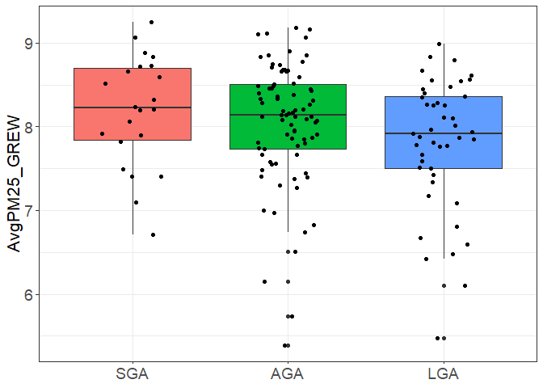
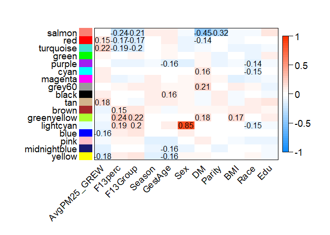

## Analysis Description

This is an R Markdown document describing the evaluation of PM2.5 during
pregnancy and alterations in placental gene expression patterns within
the Rhode Island Child Health Study (RICHS). We are using PM2.5 averages
newly derived from daily data sent by Greg Wellenius. We calculated
weekly averages from 3M prior to conception to 40 weeks after conception
and performed DLMs in relation to SGA and LGA status. Modeling birth
weight as continuous birthweight percentiles, we observed a significant
inverse association with PM2.5 exposure during a window ranging from 12
weeks prior to conception until 13 weeks gestation. We observed a
significant positive association between PM2.5 and SGA status during a
window ranging from 2 weeks prior to gestation and 14 weeks after
conception. We observed a significant inverse association between PM2.5
and LGA status during a window ranging from 3 weeks prior to gestation
and 8 weeks after conception.

For the analysis overlaying PM2.5 data with the WGCNA network, we
averaged the window between 12 weeks prior to conception and 13 weeks
gestation based on the birthweight percentile DLM (Growth-restriction
exposure window, (GREW)).

Based on the associations with demographic variables, PM2.5 (GREW) was
associated with income (p=0.03) and borderline associated with Fenton
growth percentile (p=0.07).

Looking at correlations with the WGCNA network, modules correlated with
PM2.5 (GREW) was correlated with the red, turquoise, tan, blue and
yellow modules.

## Load required libraries

``` r
library(WGCNA)
library(tableone)
library(tidyverse)
library(broom)
library(corrplot)
```

## Load data

``` r
PM25<-readRDS("Data/richs_PM25_weekly.rds") #471

Covariates<-readRDS("../../RICHS_Variables/QCHART_01.11.14v1.rds") #799
#WGCNA network
lnames = load(file = "../WGCNA_input.RData"); #200
load("../WGCNA_full.RData")

RNA_batch<-read.csv("../../RNASeq/Batch.csv")
```

## Clean dataframes

``` r
#Create dataframe with PM25 Avg. (pre12-13 weeks gestation)

PM25_GREW<-PM25%>%
  select(1:26)%>%
  rename(ID=study_id)%>%
  ungroup()%>%
  mutate(ID=as.character(ID))%>%
  gather(Week,PM2.5,-ID)%>%
  group_by(ID)%>%
  summarise(AvgPM25_GREW=mean(PM2.5))

#Create dataframe with demographic variables, simplify names and recode Income

#define income tertiles
Covariates%>%
  select(HOUSEHOLD_INCOME)%>%
  filter(!HOUSEHOLD_INCOME%in%c(0,157,158,NA))%>%
  summarise(q33=quantile(.,probs=c(0.33),na.rm=T),
            q66=quantile(.,probs=c(0.66),na.rm=T))

#q33=152 [<30000]; q66=155 [<80000]; 

Demo<-Covariates%>%
  rename(ID=Sample.ID,GestAge=GESTATIONAL_WEEKS.x,F13perc=F13.percentile,F13Group=F13.BW.group,Sex=Gender.x,DOB=DATE_OF_BIRTH,DM=DELIVERY_METHOD1,MomAge=MATERNAL_AGE_YRS,Parity=MATERNAL_TERM_BIRTHS, Smoke=TOBACCO_PREGNANCY2,Edu=MOM_EDUCATION1,Race=MATERNAL_ETHNICITY2,Income=HOUSEHOLD_INCOME,GDM=DIABETES_GESTATIONAL_PREGNANCY2,HTN=HYPERTENSION_PREGNANCY)%>%
  select(ID,DOB,F13perc,F13Group,GestAge,Sex,DM,Parity, MomAge,Race,Edu,Income, Smoke,GDM,BMI,HTN)%>%
  mutate(ID=as.character(ID),
         HTN=as.factor(ifelse(is.na(HTN),NA,
                              ifelse(HTN==6,"Yes","No"))),
         Parity=as.factor(ifelse(Parity==10|is.na(Parity),NA,
                       ifelse(Parity==0,"Nulliparous","Parous"))),
         Edu=as.factor(ifelse(is.na(Edu),NA,
                              ifelse(Edu=="< 11th grade","Less than HS grad",
                                     ifelse(Edu=="High school graduate","HS grad",
                                            ifelse(Edu=="Junior college graduate or equivalent", "Some College", "College grad and above"))))),
         Race=as.factor(ifelse(is.na(Race),NA,
                               ifelse(Race=="White","White",
                                      ifelse(Race=="Black","Black","Other")))),
         Income=as.factor(ifelse(is.na(Income)|Income==0|Income>156,NA,
                                 ifelse(Income>0&Income<152,"<30K",
                                        ifelse(Income>=152&Income<155,"30-79K","80K+")))),
         DOB=gsub("/.*$","",DOB),
         Season=as.factor(ifelse(DOB%in%c("12","2","1"),"Winter",
                                ifelse(DOB%in%c("3","4","5"),"Spring",
                                        ifelse(DOB%in%c("6","7","8"),"Summer","Fall")))))
  
RNA_batch<-RNA_batch%>%
  filter(!grepl("-2|-3",ID))%>%
  mutate(ID=gsub("-1","",ID))%>%
  rename(batch=initial.batch.number)%>%
  select(ID,batch)

#WGCNA modules
moduleLabelsAutomatic=net$colors 
table(moduleLabelsAutomatic)
#0    1    2    3     4   5    6    7    8    9    10   11   12   13   14   15   16   17  
#998 3073 2757 1411  583  505  486  458  434  337  217  201  198  162  154  86   38   37 
moduleColorsAutomatic = labels2colors(moduleLabelsAutomatic)
```

## Generate demographics table

``` r
#Compare total RICHS population and subset with WGCNA/PM2.5 data
Demo_table_full<-Demo%>%
  left_join(PM25_GREW)%>%
  select(ID,AvgPM25_GREW,F13perc,F13Group,GestAge,Sex,DM,Parity,MomAge,Race,Edu,Income,Smoke,BMI,Season)%>%
  mutate(F13Group=factor(F13Group,levels=c("SGA","AGA","LGA")),
         Cohort='Full')

Demo_table_PM<-Demo%>%
  left_join(PM25_GREW)%>%
  select(ID,AvgPM25_GREW,F13perc,F13Group,GestAge,Sex,DM,Parity,MomAge,Race,Edu,Income,Smoke,BMI,Season)%>%
  filter(!is.na(AvgPM25_GREW))%>%
  mutate(F13Group=factor(F13Group,levels=c("SGA","AGA","LGA")),
         Cohort='PM')


Demo_table_subset<-Demo%>%
  left_join(PM25_GREW)%>%
  select(ID,AvgPM25_GREW,F13perc,F13Group,GestAge,Sex,DM,Parity,MomAge,Race,Edu,Income,Smoke,BMI,Season)%>%
  filter(!is.na(AvgPM25_GREW)&ID%in%rownames(datTraits))%>%
  mutate(F13Group=factor(F13Group,levels=c("SGA","AGA","LGA")),
         Cohort='Subset')
  
Demo_table<-rbind(Demo_table_full,Demo_table_PM,Demo_table_subset)
  
#Table Full cohort vs PM vs WGCNA subset
myVars <- names(Demo_table)[!names(Demo_table)%in%c('ID')]
catVars <- c("Sex", "Parity","F13Group", "DM",'Edu','Race','Income','Smoke',"Season","Cohort")

tab <- CreateTableOne(vars = myVars, data = Demo_table, strata = "Cohort",factorVars = catVars,includeNA=T)
print(tab,showAllLevels = T)
```

    ##                           Stratified by Cohort
    ##                            level                  Full           PM            
    ##   n                                                 799            471         
    ##   AvgPM25_GREW (mean (SD))                         7.97 (0.79)    7.97 (0.79)  
    ##   F13perc (mean (SD))                             53.48 (34.48)  58.18 (34.07) 
    ##   F13Group (%)             SGA                      157 ( 19.6)     77 ( 16.3) 
    ##                            AGA                      456 ( 57.1)    260 ( 55.2) 
    ##                            LGA                      186 ( 23.3)    134 ( 28.5) 
    ##   GestAge (mean (SD))                             39.00 (0.95)   38.99 (0.92)  
    ##   Sex (%)                  Female                   401 ( 50.2)    227 ( 48.2) 
    ##                            Male                     398 ( 49.8)    244 ( 51.8) 
    ##   DM (%)                   C-Section                408 ( 51.1)    250 ( 53.1) 
    ##                            Vaginal                  391 ( 48.9)    221 ( 46.9) 
    ##   Parity (%)               Nulliparous              326 ( 40.8)    188 ( 39.9) 
    ##                            Parous                   467 ( 58.4)    281 ( 59.7) 
    ##                            <NA>                       6 (  0.8)      2 (  0.4) 
    ##   MomAge (mean (SD))                              29.72 (5.47)   30.03 (5.65)  
    ##   Race (%)                 Black                     60 (  7.5)     28 (  5.9) 
    ##                            Other                    151 ( 18.9)     81 ( 17.2) 
    ##                            White                    585 ( 73.2)    361 ( 76.6) 
    ##                            <NA>                       3 (  0.4)      1 (  0.2) 
    ##   Edu (%)                  College grad and above   400 ( 50.1)    249 ( 52.9) 
    ##                            HS grad                  144 ( 18.0)     76 ( 16.1) 
    ##                            Less than HS grad         60 (  7.5)     26 (  5.5) 
    ##                            Some College             188 ( 23.5)    115 ( 24.4) 
    ##                            <NA>                       7 (  0.9)      5 (  1.1) 
    ##   Income (%)               <30K                     204 ( 25.5)    117 ( 24.8) 
    ##                            30-79K                   224 ( 28.0)    137 ( 29.1) 
    ##                            80K+                     289 ( 36.2)    172 ( 36.5) 
    ##                            <NA>                      82 ( 10.3)     45 (  9.6) 
    ##   Smoke (%)                No                       746 ( 93.4)    441 ( 93.6) 
    ##                            Yes                       42 (  5.3)     23 (  4.9) 
    ##                            <NA>                      11 (  1.4)      7 (  1.5) 
    ##   BMI (mean (SD))                                 26.60 (7.00)   26.94 (7.10)  
    ##   Season (%)               Fall                     171 ( 21.4)    136 ( 28.9) 
    ##                            Spring                   216 ( 27.0)    111 ( 23.6) 
    ##                            Summer                   261 ( 32.7)    137 ( 29.1) 
    ##                            Winter                   151 ( 18.9)     87 ( 18.5) 
    ##   Cohort (%)               Full                     799 (100.0)      0 (  0.0) 
    ##                            PM                         0 (  0.0)    471 (100.0) 
    ##                            Subset                     0 (  0.0)      0 (  0.0) 
    ##                           Stratified by Cohort
    ##                            Subset         p      test
    ##   n                          149                     
    ##   AvgPM25_GREW (mean (SD))  7.99 (0.74)    0.943     
    ##   F13perc (mean (SD))      56.93 (34.14)   0.053     
    ##   F13Group (%)                22 ( 14.8)   0.117     
    ##                               82 ( 55.0)             
    ##                               45 ( 30.2)             
    ##   GestAge (mean (SD))      38.95 (0.96)    0.865     
    ##   Sex (%)                     71 ( 47.7)   0.725     
    ##                               78 ( 52.3)             
    ##   DM (%)                      67 ( 45.0)   0.225     
    ##                               82 ( 55.0)             
    ##   Parity (%)                  53 ( 35.6)   0.538     
    ##                               96 ( 64.4)             
    ##                                0 (  0.0)             
    ##   MomAge (mean (SD))       31.23 (4.78)    0.008     
    ##   Race (%)                     7 (  4.7)   0.502     
    ##                               22 ( 14.8)             
    ##                              120 ( 80.5)             
    ##                                0 (  0.0)             
    ##   Edu (%)                     91 ( 61.1)   0.194     
    ##                               17 ( 11.4)             
    ##                                5 (  3.4)             
    ##                               34 ( 22.8)             
    ##                                2 (  1.3)             
    ##   Income (%)                  25 ( 16.8)   0.130     
    ##                               38 ( 25.5)             
    ##                               72 ( 48.3)             
    ##                               14 (  9.4)             
    ##   Smoke (%)                  142 ( 95.3)   0.377     
    ##                                3 (  2.0)             
    ##                                4 (  2.7)             
    ##   BMI (mean (SD))          26.25 (6.28)    0.525     
    ##   Season (%)                  42 ( 28.2)   0.025     
    ##                               29 ( 19.5)             
    ##                               55 ( 36.9)             
    ##                               23 ( 15.4)             
    ##   Cohort (%)                   0 (  0.0)  <0.001     
    ##                                0 (  0.0)             
    ##                              149 (100.0)

``` r
tabMat <- print(tab,quote = FALSE, noSpaces = FALSE, printToggle = FALSE)
write.csv(tabMat, file = "Tables/PM25(GREW)_Full.vs.subset_cohort_table.csv")

#Table of differences by birthweight among PM25/WGCNA subset
myVars <- names(Demo_table_subset)[!names(Demo_table_subset)%in%c('ID')]
catVars <- c("Sex", "Parity","F13Group", "DM",'Edu','Race','Income','Smoke',"Season")
tab <- CreateTableOne(vars = myVars, data = Demo_table_subset, strata = "F13Group",factorVars = catVars,includeNA=T)
print(tab,showAllLevels = T)
```

    ##                           Stratified by F13Group
    ##                            level                  SGA            AGA           
    ##   n                                                  22             82         
    ##   AvgPM25_GREW (mean (SD))                         8.18 (0.66)    8.04 (0.73)  
    ##   F13perc (mean (SD))                              4.77 (3.04)   50.11 (23.19) 
    ##   F13Group (%)             SGA                       22 (100.0)      0 (  0.0) 
    ##                            AGA                        0 (  0.0)     82 (100.0) 
    ##                            LGA                        0 (  0.0)      0 (  0.0) 
    ##   GestAge (mean (SD))                             38.86 (1.25)   38.98 (0.98)  
    ##   Sex (%)                  Female                    13 ( 59.1)     41 ( 50.0) 
    ##                            Male                       9 ( 40.9)     41 ( 50.0) 
    ##   DM (%)                   C-Section                  9 ( 40.9)     30 ( 36.6) 
    ##                            Vaginal                   13 ( 59.1)     52 ( 63.4) 
    ##   Parity (%)               Nulliparous               11 ( 50.0)     35 ( 42.7) 
    ##                            Parous                    11 ( 50.0)     47 ( 57.3) 
    ##   MomAge (mean (SD))                              31.95 (6.14)   30.98 (4.70)  
    ##   Race (%)                 Black                      3 ( 13.6)      2 (  2.4) 
    ##                            Other                      5 ( 22.7)     13 ( 15.9) 
    ##                            White                     14 ( 63.6)     67 ( 81.7) 
    ##   Edu (%)                  College grad and above    14 ( 63.6)     51 ( 62.2) 
    ##                            HS grad                    4 ( 18.2)     10 ( 12.2) 
    ##                            Less than HS grad          1 (  4.5)      3 (  3.7) 
    ##                            Some College               3 ( 13.6)     18 ( 22.0) 
    ##                            <NA>                       0 (  0.0)      0 (  0.0) 
    ##   Income (%)               <30K                       5 ( 22.7)     10 ( 12.2) 
    ##                            30-79K                     6 ( 27.3)     18 ( 22.0) 
    ##                            80K+                       8 ( 36.4)     48 ( 58.5) 
    ##                            <NA>                       3 ( 13.6)      6 (  7.3) 
    ##   Smoke (%)                No                        19 ( 86.4)     79 ( 96.3) 
    ##                            Yes                        1 (  4.5)      1 (  1.2) 
    ##                            <NA>                       2 (  9.1)      2 (  2.4) 
    ##   BMI (mean (SD))                                 25.19 (7.19)   25.44 (5.54)  
    ##   Season (%)               Fall                       6 ( 27.3)     26 ( 31.7) 
    ##                            Spring                     3 ( 13.6)     16 ( 19.5) 
    ##                            Summer                     8 ( 36.4)     27 ( 32.9) 
    ##                            Winter                     5 ( 22.7)     13 ( 15.9) 
    ##   Cohort (%)               Subset                    22 (100.0)     82 (100.0) 
    ##                           Stratified by F13Group
    ##                            LGA            p      test
    ##   n                           45                     
    ##   AvgPM25_GREW (mean (SD))  7.81 (0.78)    0.098     
    ##   F13perc (mean (SD))      94.86 (2.70)   <0.001     
    ##   F13Group (%)                 0 (  0.0)  <0.001     
    ##                                0 (  0.0)             
    ##                               45 (100.0)             
    ##   GestAge (mean (SD))      38.96 (0.77)    0.890     
    ##   Sex (%)                     17 ( 37.8)   0.213     
    ##                               28 ( 62.2)             
    ##   DM (%)                      28 ( 62.2)   0.019     
    ##                               17 ( 37.8)             
    ##   Parity (%)                   7 ( 15.6)   0.003     
    ##                               38 ( 84.4)             
    ##   MomAge (mean (SD))       31.36 (4.21)    0.684     
    ##   Race (%)                     2 (  4.4)   0.103     
    ##                                4 (  8.9)             
    ##                               39 ( 86.7)             
    ##   Edu (%)                     26 ( 57.8)   0.394     
    ##                                3 (  6.7)             
    ##                                1 (  2.2)             
    ##                               13 ( 28.9)             
    ##                                2 (  4.4)             
    ##   Income (%)                  10 ( 22.2)   0.227     
    ##                               14 ( 31.1)             
    ##                               16 ( 35.6)             
    ##                                5 ( 11.1)             
    ##   Smoke (%)                   44 ( 97.8)   0.216     
    ##                                1 (  2.2)             
    ##                                0 (  0.0)             
    ##   BMI (mean (SD))          28.33 (6.76)    0.034     
    ##   Season (%)                  10 ( 22.2)   0.697     
    ##                               10 ( 22.2)             
    ##                               20 ( 44.4)             
    ##                                5 ( 11.1)             
    ##   Cohort (%)                  45 (100.0)   NA

``` r
tabMat <- print(tab,quote = FALSE, noSpaces = FALSE, printToggle = FALSE)

write.csv(tabMat, file = "Tables/PM25(GREW)_subset_BW_table.csv")


#Table of differences by birthweight in full cohort
myVars <- names(Demo_table_full)[!names(Demo_table_full)%in%c('ID')]
catVars <- c("Sex", "Parity","F13Group", "DM",'Edu','Race','Income','Smoke',"Season")
tab <- CreateTableOne(vars = myVars, data = Demo_table_full, strata = "F13Group",factorVars = catVars,includeNA=T)
print(tab,showAllLevels = T)
```

    ##                           Stratified by F13Group
    ##                            level                  SGA            AGA           
    ##   n                                                 157            456         
    ##   AvgPM25_GREW (mean (SD))                         8.19 (0.75)    7.96 (0.81)  
    ##   F13perc (mean (SD))                              5.13 (3.18)   53.13 (23.68) 
    ##   F13Group (%)             SGA                      157 (100.0)      0 (  0.0) 
    ##                            AGA                        0 (  0.0)    456 (100.0) 
    ##                            LGA                        0 (  0.0)      0 (  0.0) 
    ##   GestAge (mean (SD))                             39.04 (1.12)   38.99 (0.94)  
    ##   Sex (%)                  Female                    93 ( 59.2)    220 ( 48.2) 
    ##                            Male                      64 ( 40.8)    236 ( 51.8) 
    ##   DM (%)                   C-Section                 63 ( 40.1)    206 ( 45.2) 
    ##                            Vaginal                   94 ( 59.9)    250 ( 54.8) 
    ##   Parity (%)               Nulliparous               86 ( 54.8)    184 ( 40.4) 
    ##                            Parous                    68 ( 43.3)    270 ( 59.2) 
    ##                            <NA>                       3 (  1.9)      2 (  0.4) 
    ##   MomAge (mean (SD))                              28.39 (6.07)   29.83 (5.34)  
    ##   Race (%)                 Black                     24 ( 15.3)     25 (  5.5) 
    ##                            Other                     44 ( 28.0)     85 ( 18.6) 
    ##                            White                     89 ( 56.7)    344 ( 75.4) 
    ##                            <NA>                       0 (  0.0)      2 (  0.4) 
    ##   Edu (%)                  College grad and above    62 ( 39.5)    235 ( 51.5) 
    ##                            HS grad                   33 ( 21.0)     75 ( 16.4) 
    ##                            Less than HS grad         15 (  9.6)     39 (  8.6) 
    ##                            Some College              46 ( 29.3)    104 ( 22.8) 
    ##                            <NA>                       1 (  0.6)      3 (  0.7) 
    ##   Income (%)               <30K                      53 ( 33.8)    110 ( 24.1) 
    ##                            30-79K                    40 ( 25.5)    121 ( 26.5) 
    ##                            80K+                      40 ( 25.5)    184 ( 40.4) 
    ##                            <NA>                      24 ( 15.3)     41 (  9.0) 
    ##   Smoke (%)                No                       132 ( 84.1)    432 ( 94.7) 
    ##                            Yes                       20 ( 12.7)     18 (  3.9) 
    ##                            <NA>                       5 (  3.2)      6 (  1.3) 
    ##   BMI (mean (SD))                                 25.08 (6.77)   26.19 (6.65)  
    ##   Season (%)               Fall                      37 ( 23.6)     96 ( 21.1) 
    ##                            Spring                    41 ( 26.1)    121 ( 26.5) 
    ##                            Summer                    44 ( 28.0)    155 ( 34.0) 
    ##                            Winter                    35 ( 22.3)     84 ( 18.4) 
    ##   Cohort (%)               Full                     157 (100.0)    456 (100.0) 
    ##                           Stratified by F13Group
    ##                            LGA            p      test
    ##   n                          186                     
    ##   AvgPM25_GREW (mean (SD))  7.86 (0.76)    0.014     
    ##   F13perc (mean (SD))      95.17 (2.89)   <0.001     
    ##   F13Group (%)                 0 (  0.0)  <0.001     
    ##                                0 (  0.0)             
    ##                              186 (100.0)             
    ##   GestAge (mean (SD))      38.98 (0.79)    0.794     
    ##   Sex (%)                     88 ( 47.3)   0.040     
    ##                               98 ( 52.7)             
    ##   DM (%)                     139 ( 74.7)  <0.001     
    ##                               47 ( 25.3)             
    ##   Parity (%)                  56 ( 30.1)  <0.001     
    ##                              129 ( 69.4)             
    ##                                1 (  0.5)             
    ##   MomAge (mean (SD))       30.58 (5.06)    0.001     
    ##   Race (%)                    11 (  5.9)  <0.001     
    ##                               22 ( 11.8)             
    ##                              152 ( 81.7)             
    ##                                1 (  0.5)             
    ##   Edu (%)                    103 ( 55.4)   0.030     
    ##                               36 ( 19.4)             
    ##                                6 (  3.2)             
    ##                               38 ( 20.4)             
    ##                                3 (  1.6)             
    ##   Income (%)                  41 ( 22.0)   0.002     
    ##                               63 ( 33.9)             
    ##                               65 ( 34.9)             
    ##                               17 (  9.1)             
    ##   Smoke (%)                  182 ( 97.8)  <0.001     
    ##                                4 (  2.2)             
    ##                                0 (  0.0)             
    ##   BMI (mean (SD))          28.90 (7.51)   <0.001     
    ##   Season (%)                  38 ( 20.4)   0.755     
    ##                               54 ( 29.0)             
    ##                               62 ( 33.3)             
    ##                               32 ( 17.2)             
    ##   Cohort (%)                 186 (100.0)   NA

``` r
tabMat <- print(tab,quote = FALSE, noSpaces = FALSE, printToggle = FALSE)

write.csv(tabMat, file = "Tables/PM25(GREW)_full_BW_table.csv")
```

## Boxplot of PM2.5 across birthweight categories in full RICHS and WGCNA subset

``` r
PM25_BW_boxplot_Full<-ggplot(Demo_table_full,aes(F13Group, AvgPM25_GREW,fill=F13Group))+
  geom_boxplot()+
  geom_jitter(width=0.2)+
  theme_bw()+
  theme(axis.title.x=element_blank(),
        axis.title.y=element_text(size=16),
        axis.text=element_text(size=14),
        legend.position = "none")

PM25_BW_boxplot_Full
```

<!-- -->

``` r
pdf("Plots/PM25_BW_boxplot_Full.pdf")
PM25_BW_boxplot_Full
dev.off()


PM25_BW_boxplot_WGCNA<-ggplot(Demo_table_subset,aes(F13Group, AvgPM25_GREW,fill=F13Group))+
  geom_boxplot()+
  geom_jitter(width=0.2)+
  theme_bw()+
  theme(axis.title.x=element_blank(),
        axis.title.y=element_text(size=16),
        axis.text=element_text(size=14),
        legend.position = "none")

PM25_BW_boxplot_WGCNA
```

<!-- -->

``` r
pdf("Plots/PM25_BW_boxplot_WGCNA.pdf")
PM25_BW_boxplot_WGCNA
dev.off()
```

## Distribution of airpollution measures

``` r
Demo_table_full%>%
  select(AvgPM25_GREW)%>%
  summarise_all(funs(min,max),na.rm=TRUE)
#pm25_min           pm25_max   
#5.391423            10.58812                    

Demo_table_subset%>%
  select(AvgPM25_GREW)%>%
  summarise_all(funs(min,max),na.rm=TRUE)

#pm25_min         pm25_max   
#5.391423           9.250727                     

PM25_hist_WGCNA_Full<-Demo_table%>%
  ggplot(.,aes(AvgPM25_GREW, fill=Cohort))+
  geom_density(alpha = 0.5)+
  theme_bw()+
  xlab("Average PM2.5 (ug/m3)")+
  theme(axis.title.y=element_blank())

PM25_hist_WGCNA_Full
```

<!-- -->

``` r
pdf("Plots/PM25_hist_WGCNA_Full.pdf")
PM25_hist_WGCNA_Full
dev.off()
```

## Differences in PM25 levels by demographic characteristics in WGCNA subset: No significant differences. PM2.5 is weakly correlated with F13 percentile (p=0.09)

``` r
PM25_Demo<-Demo_table_subset%>%
  select(-c(Cohort))%>%
  gather(Covariate,value,-c(ID,AvgPM25_GREW))%>%
  mutate(Type=ifelse(Covariate%in%c("F13perc","BMI","GestAge","MomAge"),"cont","cat"))

PM25_Cor_GREW<-PM25_Demo%>%
  filter(Type=='cont')%>%
  group_by(Covariate)%>%
  do(tidy(cor.test(x=.$AvgPM25_GREW, y=as.numeric(.$value),method="spearman")))

PM25_AOV_GREW<-PM25_Demo%>%
  filter(Covariate%in%c("F13Group","Edu","Race","Parity","Income","Season"))%>%
  group_by(Covariate)%>%
  do(tidy(kruskal.test(as.numeric(AvgPM25_GREW)~factor(value), data = .)))

PM25_tt_GREW<-PM25_Demo%>%
  filter(Covariate%in%c("Delivery","Sex","Smoke"))%>%
  group_by(Covariate)%>%
  do(tidy(wilcox.test(AvgPM25_GREW ~ value, data = .)))

#Boxplots of categorical variables
PM25_Demo_boxplot_GREW_WGCNA<-PM25_Demo%>%
  filter(Type=="cat")%>%
  mutate(value=factor(value,levels=c("C-Section","Vaginal","Less than HS grad","HS grad","Some College","College grad and above","SGA","AGA","LGA","<30K","30-79K","80K+","Nulliparous","Parous","White","Black","Other","Spring","Summer","Fall","Winter","Female","Male","No","Yes")))%>%
ggplot(., aes(value, AvgPM25_GREW))+
  geom_boxplot(aes(colour = value))+
  theme_bw()+
  labs(y="PM2.5 ug/m3 (Pre12-13weeks gestation average)")+
  theme(axis.title.x=element_blank(),
        axis.text.x  = element_text(angle=90),
        legend.position = 'none',
        strip.background = element_rect(fill="white"),
        strip.text=element_text(face="bold"))+
  facet_wrap(~Covariate,scales="free")

PM25_Demo_boxplot_GREW_WGCNA
```

<!-- -->

``` r
pdf("Plots/PM25_Demo_boxplot_GREW_WGCNA.pdf")
PM25_Demo_boxplot_GREW_WGCNA
dev.off()

#scatter plots of continuous variables
PM25_Demo_scatter_GREW_WGCNA<-PM25_Demo%>%
  filter(Type=="cont")%>%
ggplot(., aes(AvgPM25_GREW,as.integer(value)))+
  geom_point()+
  theme_bw()+
  labs(x="PM2.5 ug/m3 (Pre12-13weeks gestation average)")+
  theme(axis.title.y=element_blank(),
        legend.position = 'none',
        strip.background = element_rect(fill="white"),
        strip.text=element_text(face='bold'))+
  facet_wrap(Covariate~., ncol=2,scales = "free")

PM25_Demo_scatter_GREW_WGCNA
```

<!-- -->

``` r
pdf("Plots/PM25_Demo_scatter_GREW_WGCNA.pdf")
PM25_Demo_scatter_GREW_WGCNA
dev.off()
```

## Relationship among demographic characteristics

``` r
Demo_table_subset%>%
    mutate(Race=factor(Race,levels=c("White","Black","Other")))%>%
    group_by(Race, Income)%>% 
    summarise(n = n()) %>%
    mutate(prop = n / sum(n)) %>%
    ggplot(., aes(x=Income,y=Race))+
    geom_point( aes(size=prop))+
    theme(panel.background=element_blank())
```

<!-- -->

``` r
Demo_table_subset%>%
  mutate(Race=factor(Race,levels=c("White","Black","Other")),
         Edu=factor(Edu,levels=c("Less than HS grad","HS grad","Some College","College grad and above")))%>%
    group_by(Race, Edu) %>% 
    summarise(n = n()) %>%
    mutate(prop = n / sum(n)) %>%
    ggplot(., aes(x=Edu,y=Race))+
    geom_point( aes(size=n))+
    theme(panel.background=element_blank())
```

<!-- -->

``` r
Demo_table_subset%>%
  mutate(Edu=factor(Edu,levels=c("Less than HS grad","HS grad","Some College","College grad and above")))%>%
    group_by(Income, Edu) %>% 
    summarise(n = n()) %>%
    mutate(prop = n / sum(n)) %>%
    ggplot(., aes(x=Edu,y=Income))+
    geom_point( aes(size=n))+
    theme(panel.background=element_blank())
```

<!-- -->

## Correlation between Exposures and WGCNA network

``` r
Demo_ME<-Demo%>%
  filter(ID%in%rownames(datTraits))%>%
  left_join(PM25_GREW)%>%
  select(AvgPM25_GREW,F13perc,F13Group,Season,GestAge,Sex,DM,Parity,BMI,Race,Edu,)%>%
  mutate(F13Group=ifelse(F13Group=="SGA",1,
                         ifelse(F13Group=="AGA",2,3)),
         Season=ifelse(Season=="Spring",1,
                       ifelse(Season=="Summer",2,
                              ifelse(Season=="Fall",3,4))),
         Sex=ifelse(Sex=="Female",1,2),
         DM=ifelse(DM=="Vaginal",1,2),
         Parity=ifelse(Parity=="Nulliparous",1,2),
         Race=ifelse(Race=="White",1,
                     ifelse(Race=="Black",2,3)),
         Edu=ifelse(Edu=="Less than HS grad",1,
                    ifelse(Edu=="HS grad",2,
                           ifelse(Edu=="Some College",3,4))))
  
# Define numbers of genes and samples 
nGenes = ncol(datExpr0) 
nSamples = nrow(datExpr0)
MEs0 = moduleEigengenes(datExpr0,moduleColorsAutomatic)$eigengenes
MEs0= orderMEs(MEs0) 
MEs0<-MEs0[,-18]
#names(MEs0)<-gsub('ME','',names(MEs0))
modTraitCor = cor(MEs0, Demo_ME, use = "p",method="spearman") 
modTraitP = corPvalueStudent(modTraitCor, nSamples) 
textMatrix2 <-ifelse(modTraitP<0.05,paste(signif(modTraitCor,2)), NA)
#textMatrix = paste(signif(modTraitCor, 2), "\n(", signif(modTraitP, 1), ")", sep = "") 
dim(textMatrix2) = dim(modTraitCor) 


WGCNA_heatmap<-labeledHeatmap(Matrix = modTraitCor, xLabels = names(Demo_ME), yLabels = names(MEs0), ySymbols = names(MEs0), colorLabels =FALSE,colors= blueWhiteRed (50),textMatrix=textMatrix2, setStdMargins = FALSE, cex.text = 0.8, zlim = c(-1,1))
```

<!-- -->

``` r
WGCNA_heatmap

pdf("Plots/PM25_corr_ME_WGCNA.pdf",width=8.5,height=6)
par(mar = c(8,10, 3, 3))
WGCNA_heatmap
dev.off()
```
